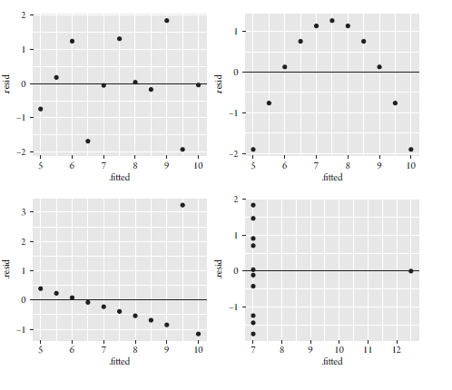

class: bottom, left

```{r setup, include=FALSE, cache = FALSE}
require("knitr")
options(htmltools.dir.version = FALSE)
```

<!---
Para correr en ATOM
- open terminal, abrir R (simplemente, R y enter)
- rmarkdown::render('11_diagnostico.Rmd', 'xaringan::moon_reader')

About macros.js: permite escalar las imágenes como [scale 50%](path to image), hay si que grabar ese archivo js en el directorio.
--->

.right[]

<br>
<br>
<br>
<br>
<br>
<br>
<br>

# Estadística multivariada, 1 sem. 2019

## Juan Carlos Castillo & Alejandro Plaza

## **Sesión 11**: Diagnóstico de supuestos

---
class:roja,center, middle

.large[
# ¿Supuestos?
]

---
class: inverse

## Contenidos

### 1. Motivación: El cuarteto de Anscombe

### 2. Linealidad y Especificación del Modelo

### 3. Perfecta y Alta Multicolinealidad

### 4. Error Constante de la varianza (u Homocedasticidad)

### 5. Observaciones Influyentes

### 6. Normalidad de los residuos

### 7. Reporte de Resultados

---
class: inverse, middle, center

# 1. Motivación: El cuarteto de Anscombe


---
#El cuarteto de Anscombe

Para ilustrar la importancia de la revisión de supuestos, partiremos trabajando con el cuarteto de Anscombe.

El cuarteto de Anscombe es una base de datos donde se pueden estimar distintos modelos de regresión, obteniendo las mismas estimaciones, pero el comportamiento de las variables es diferente.


---

##Modelos de Regresión en base a Anscombe

```{r echo=FALSE}
pacman::p_load(stargazer,tidyverse,gridExtra,ggplot2,gridExtra,broom,
car,lmtest,sandwich,interplot,ape,multiwayvcov)
a1<-lm(y1~x1,data=anscombe)
a2<-lm(y2~x2,data=anscombe)
a3<-lm(y3~x3,data=anscombe)
a4<-lm(y4~x4,data=anscombe)
```

.small[
```{r results='asis', echo=FALSE}
stargazer(a1, a2, a3, a4, type="html", no.space=TRUE,
model.names=FALSE, notes="Errores Estándares en Parentesis",single.row=TRUE)
```
]]

---
#Visualización de las regresiones

```{r echo=FALSE}
# 4 nubes de puntos con las rectas de regresión.
F1 <- ggplot(anscombe)+aes(x1,y1)+geom_point()+
geom_abline(intercept=3,slope=0.5)

F2 <- ggplot(anscombe)+aes(x2,y2)+geom_point()+
geom_abline(intercept=3,slope=0.5)

F3 <- ggplot(anscombe)+aes(x3,y3)+geom_point()+
  geom_abline(intercept=3,slope=0.5)

F4 <- ggplot(anscombe)+aes(x4,y4)+geom_point()+
  geom_abline(intercept=3,slope=0.5)

# Mostrar los 4 gráficos en una figura
grid.arrange(F1,F2,F3,F4, ncol = 2)
```

---
##¿Qué implica esto?

OLS captura de manera certera la relación entre x1 e y1, pero falla en...

  - x2 e y2 tienen una relación curvilinea entre sí.

  - x3 e y3 tienen una moderada influencia de un outlier.

  - x4 e y4 tienen una severa influencia de un outlier.

--

Una de las formas más sencillas de realizar un diagnóstico de los modelos de regresión es gráficar la relación entre los valores predichos (recordemos $\hat{Y}$) y los residuos (recordando $\hat{Y}-Y$).

Estos gráficos nos permiten detectar problemas de **No linealidad**, **Heterocedasticidad (varianza del error no constate)**, y **outliers**.

---
##Gráficos de Diagnóstico


---
## ¿Cómo interpretamos estos gráficos?

--
* Si el **supuesto de linealidad ** y correcta especificación del modelo se sostiene, entonces:

   - Los residuos deberían verse distribuidos aleatorialemte alrededos de la linea residual=0. Cualquier patrón sistemático violaría este supuesto.

--
* Si el **supuesto de Homocedasticidad** o la varianza del error es constante en las observacione, se sostiene entonces:

   - Los residuos deberían estar distribuidos de manera constate en la banda alrededor de la linea residual=0. Formas de abanico, o de embudo indicarian que la varianza de los errores no son constantes.

--
* Presencia de **observaciones influyentes o outliers**

   - Ninguna observación debería desviarse muy lejos de otras observaciones, tanto para los residuos como para los valores predichos.  De encontrarse un patrón de esta forma estariamos ante la presencia de outliers.

---

## Entonces... ¿Cómo deberían verse los gráficos?


---
## ...Pero además debemos revisar los siguientes aspectos

No obstante hay cosas que no se pueden observar en estos gráficos:

### - Supuesto de no **Multicolinealidad**

  - Inflación de los erros éstandar de los coeficientes betas, por lo cual la inferencia poblacional de los parametros se vuelve dudosa o problemática.

### - Supuesto de **Normalidad de los residuos**

 - De no cumplirse vuelve las estimaciones más ineficientes.

---


## Datos con los que trabajaremos


Para realizar el diagnóstico al modelo de regresión lineal trabajaremos con una base de datos que evalua el efecto del comercio en el crecimiento económico.

**Frankel, Jeffrey A., and David Romer. 1999. "Does trade cause growth?", American Economic Review 89(3): 379–99.**

--
Se estudian los factores que predicen el PIB per capita (**logy**) en los paises, a partir de las siguientes variables independientes:

 - **open**: Apertura comercial.

 - **loglab**: la población económicamente activa

 - **Logland**: Área de la tierra.

Para consideraciones de este ejercicio sólo trabajaremos con los datos de 1985.

---
class: inverse, middle, center

#  2. Linealidad y Especificación del Modelo

---
## Linealidad

Una de la condiciones del teorema Gauss-Markov es que en el modelo estimado los parámetros son lineales entre sí. Es decir:

$$y=\beta_{0}+\beta_{1}x+u$$

**Especificación correcta** implica la forma funcional correcta y que no se han omitido variables relevantes en la estimación.

--

Ej: _Sesgo de variable omitida_

Ej. Predecir la disposición favorable hacia la protesta, a partir de la percepción de la desigualdad, pero no se incluye la posición política.


---
## Linealidad del modelos

.pull-left[.small[
```{r echo=FALSE}
load("final.85.RData")
```

```{r echo=FALSE}
# estimate OLS model and create output object
model1 <- lm(logy ~ open + loglab +
               logland, data=final.85)
```


```{r echo=FALSE, results='asis'}
stargazer(model1, type="html",single.row=TRUE)
```

]]
--
.pull-right[.small[
```{r echo=FALSE}
final.85v2 <- augment_columns(model1, final.85)
ggplot(final.85v2, aes(x=.fitted, y=.resid)) +
geom_hline(yintercept=0) +
geom_point() +
geom_smooth(method='loess', se=TRUE)
```

]]

---
## Interpretación del gráfico de Diagnóstico.

Los residuos deben ser **independientes** de los valores predichos de las variables dependientes. Cualquier correlación entre los residuos y los valores predichos violarían este supuesto.

--

- Sí los residuos muestran una patrón no lineal, como una **relación curvilinea**, el modelo esta especificado incorrectamente.

--

- Si la variable dependiente está relacionada linealmente con las variables independientes, el gráfico no deberia mostrar una **relación sistematica entre valores predichos y residuos**.

--

En el caso del gráfico anterior:

- La mayoría de los puntos están distribuidos aleatoriamente alrededor de la linea residual=0, y el intervalo de confianza de la curva ajustada se solapara con la línea residual=0.


---
## Análisis de Linealidad por variable


.small[
```{r echo=FALSE}
# residuals against trade
ropen <- ggplot(final.85v2, aes(x=open, y=.resid)) +
geom_hline(yintercept=0) +
geom_point() +
geom_smooth(method='loess', se=TRUE)
# residuals against land
rland <- ggplot(final.85v2, aes(x=logland, y=.resid)) +
geom_hline(yintercept=0) +
geom_point() +
geom_smooth(method='loess', se=TRUE)
# residuals against labor
rlab <- ggplot(final.85v2, aes(x=loglab, y=.resid)) +
geom_hline(yintercept=0) +
geom_point() +
geom_smooth(method='loess', se=TRUE)
# display plots together
grid.arrange(ropen, rland, rlab, ncol=3)
```
]

---

## Análisis de Linealidad por test estadístico.

Si bien, los gráficos pueden ser ilustrativos, no reemplazan un posterior análisis estadístico. En este caso realizamos el test de la especificación del error de Ramsey o **RESET**.

--

En términos generales, a partir del modelo estimado, se estima otro "expandido" el cuál incluye términos cuadráticos ( $\hat{y}^2$ ) o cúbicos ( $\hat{y}^3$ )  (para modelar la no linealidad), y luego se compara este modelo expandido con el modelo original.

--

La comparación se realiza a partir de la prueba $F$ (recordar F para comparación de modelos), en donde se prueba la hipótesis nula de que el modelos original  el expandido explicación el mismo monto de variación sobre la variable dependiente.

--

Si la hipótesis nula es rechazada, entonces algunas de las variables independientes afectan a la variable dependiente de manera no-lineal.

--

Por lo que se espera que **no existan diferencias** estadísticamente significativas.

---
## Análisis de Linealidad por test estadístico.

```{r eval=FALSE}
#Estimamos el modelo
model1 <- lm(logy ~ open + loglab + logland, data=final.85v2)
final.85v2$predicho<- fitted(model1) #Valores predichos Y gorro.

#estimados el modelo expandido, incluyendo los valores predichos al cuadrado
model1.q1 <- lm(logy ~ open + loglab + logland + I(predicho^2),
data = final.85v2)

# Prueba F para diferencias de modelo
anova(model1, model1.q1)
```
---
## Análisis de Linealidad por test estadístico.
```{r echo=FALSE}
#Estimamos el modelo
model1 <- lm(logy ~ open + loglab + logland, data=final.85v2)
final.85v2$predicho<- fitted(model1) #Valores predichos Y gorro.

#estimados el modelo expandido, incluyendo los valores predichos al cuadrado
model1.q1 <- lm(logy ~ open + loglab + logland + I(predicho^2),
data = final.85v2)

# Prueba F para diferencias de modelo
anova(model1, model1.q1)
```

En este caso se puede ver que $F=1.424$ con un valor $p=0.2349 que con un nivel de confianza mayor a 5% no permite rechazar la hipótesis nula que refiere a igualdad entre los modelos.


--
.small[

*En el caso de que no exista una relación lineal entre las variables del modelo, habrá que explorar relaciones no lineales, que es el contenido de la próxima clase*]

---
class: inverse, middle, center

# 3. Perfecta y Alta Multicolinealidad

---
## Perfecta y Alta Multicolinealidad.

Una segunda condición del teorema de Gauss-Markov es que las variables independientes no deben estar perfectamente correlacionadas.

Cuando dos variables están correlacionadas,la estimación por mínimos cuadrados se vuelve sensible a pequeños cambios en la muestra y en la especificación del modelo.

Además los errores estándar son más grandes que en situaciones con ausencia de multicolinealidad, por lo que las pruebas t son pequeñas, haciendo más difícil rechazar la hipótesis nula para las estimaciones de los Beta.


---
## Ejemplo de Multicolinealidad.

Para ilustrar esta situación, crearemos una nueva variable **open4**, la cual es 4 veces la variable **open**, lo cual hace que estas dos variables esten perfectamente correlacionadas.

```{r}
# crear una variable que este perfectamente correlacionada con open
final.85v2$open4 <- 4 * final.85v2$open
# revisar correlación entre ambas variables
cor(final.85v2$open, final.85v2$open4,
    use = "complete.obs")
```

---
## Ejemplo de Multicolinealidad.

.pull-left[.small[
```{r echo=FALSE, results='asis'}
# estimar un modelo incluyendo la variable nueva
stargazer(lm(logy ~ open + open4 +
             loglab + logland, data = final.85v2), type="html")
```
]]

.pull-right[
Como la variable open y open4 están perfectamente correlacionadas, éstas no pueden ser estimadas simultáneamente, y cualquiera sea ingresada en segundo lugar será descartada de la estimación.
]


---
## Detección: VIF

El factor de inflación de la varianza (VIF por sus siglas en inglés) es la prueba que más frecuentemente se utiliza para diagnósticar multicolinealidad.

Está prueba literalmente significar que el factor que infla los errores estándar de los coeficientes de regresión.

$$VIF=\frac{1}{1-R^{2}_{open}}$$
donde $R^{2}_{open}$ es el coeficiente de determinación de un nuevo modelo de regresión con open como la variable dependiente, y las variables independientes corresponden al resto de las covariables ingresadas en el modelo original (**loglab +logland**)

---
## Detección: VIF

Para entender como VIF es un buen indicador para detectar alta colinealidad, veremos una forma alternativa para estimar la varianza del $\beta$

$$\hat{var}(\beta)=\frac{s^2}{(n-1)\hat{var}(open)}*\frac{1}{1-R^{2}_{open}}$$

Donde $s^2$ es la media de los errores el cuadrado (un estimado de la varianza verdadera del término del error en el modelo de regresión poblacional), y $\hat{var}(open)$ es la varianza muestral de la variable open.


Si el VIF aumenta (en la ecuación $1/1-R^{2}_{open}$), $\hat{var}(\beta)$ aumenta por lo que el estadístico $t$ disminuye.

--


Al disminuir $t$, mayor probabilidad de no encontrar estimaciones estadísticamente significativas (Error Tipo I)

---
## Interpretación del VIF

Si $VIF=1$, entonces $R^{2}_{open}=0$, queriendo decir que la variable open es completamente independiente de las otras variables explicativas del modelo original.

Sin embargo, si $VIF=10$, entonces $R^{2}_{open}=0.9$, queriendo decir que el 90% de la varianza de la variable open puede ser explicada por las otras variables explicatias del modelo original.

---
## Interpretación del VIF

### En Resumen

  - Valores cercanos a 1 implica ausencia de multicolinealidad para la variable j.

  - Valores cercanos a 10 implica una severa multicolinealidad para la variable j.

  - Valores mayores a 4 o 5 implica una multicolinealidad moderadamente alta.

--

(Aunque Ojo, cada disciplina tiene su propio estándar, en economía valores mayores a 2 implica severos problemas.)

---
## Aplicaciones en R de VIF

Para análizar el supuesto de no multicolinealidad en R, usamos la función **vif** de la librería car.

```{r}
car::vif(model1)

```

En este caso, ninguna de las variables independientes del modelo parece sufrir de serios problemas de multicolinealidad.


En caso de presencia de multicolinealidad, remover unos de los predictores del modelo.

---
class: inverse, middle, center

# 4. Error Constante de la varianza (u Homocedasticidad)

---
## Error Constante de la Varianza

El teorema Gauss-Markov asume que la varianza del error debe permanecer constante a través de todas las observaciones.

En presencia de no varianza constante de los errores (también conocido como Heterocedasticidad), los paramétros estimados en un modelo de mínimos cuadrados permanencen insesgodos y consistentes.

--


...No obstante, los errores estándar de los coeficientes beta son estimados incorrectamente, por lo cual la prueba $t$ que utiliza éstos errores éstandares se vuelve invalida.


---
## Error Constante de la Varianza


---
## Detección gráfica de Heterocedasticidad

.pull-left[
Viendo nuevamente el gráfico de valores predichos vs. residuos, se puede apreciar que los residuos tienden a "abrirse" en la medida de que los valores predichos aumentan.

Esto, se puede observar en los intervalos de confianza de la recta ajustada (área sombreada) del gráfico.

Como lo anterior, esta primera aproximación es algo ilustrativa, pero no reemplaza las pruebas éstadísticas.

]

.pull-right[
```{r echo=FALSE}
ggplot(final.85v2, aes(x=.fitted, y=.resid)) +
geom_hline(yintercept=0) +
geom_point() +
geom_smooth(method='loess', se=TRUE)
```

]


---
## Detección Estadística de Heterocedasticidad

Para detectar Heterocedasticidad, podemos realizar los test Breush-Pagan y Cook-Weisberg.

Para ambos test, se contrasta la hipótesis nula de que la varianza del error es constante, y la hipótesis alternativa de que el error de la varianza no es constante.

???

Ojo: en este caso esperamos fallar en rechazar la hipótesis nula, por lo que buscamos valores p>0.05

---
## Detección Estadística de Heterocedasticidad

En R

.small[
```{r}
# Test de heterocedasticidad
# Estimación de modelo OLS
model1 <- lm(logy ~ open + loglab + logland, data = final.85v2)

# Cook/Weisberg score test of constant error variance
car::ncvTest(model1)

# Breush/Pagan test of constant error variance

lmtest::bptest(model1)

```
]

Los valores p de los test estadísticos son 0.44 (Cook-Weisberg) y 0.22 (Breusch-Pagan). Por lo que se falla en rechazar la hipótesis nula de que la varianza de los errores es contante, por lo que se puede concluir que se cumple el supuesto de **Homocedasticidad** del modelo.

---
##Correciones a problemas de Heterocedasticidad.

En caso de encontrar problemas de heterocedasticidad, una de las formas más usuales de corregirla, es estimando un modelo de regresión con errores estándar robustos a heterocedasticidad (Errores Estándar Robustos de White).

Los errores estándar robustos solo tienen problemas en muestras pequeñas, donde el estadístico t no tendrá una distribución probabilística cercana a t, y la inferencia estadística podría ser errónea.


```{r message=FALSE, eval=FALSE}
library(lmtest);library(sandwich)
model1.hc3 <- coeftest(model1, vcov=vcovHC)
```


---
##Correciones a problemas de Heterocedasticidad.

```{r message=FALSE, echo=FALSE}
library(lmtest);library(sandwich)
model1.hc3 <- coeftest(model1, vcov=vcovHC)
```
.small[
```{r echo=FALSE, results='asis'}
stargazer(model1, model1.hc3, type = "html", column.labels = c("OLS","Robusto"),
          model.names = FALSE, single.row=TRUE)
```
]

---
class: inverse, middle, center

# 5. Observaciones Influyentes

---

##Observaciones influyentes

.pull-left[El coeficiente de regresión representa el efecto promedio de una variable independiente en una variable dependiente, manteniendo el resto de las variables constantes.

No obstante, algunas observaciones pueden tener una influencia excesiva dentro de la estimación de los coeficientes.
]
.pull-right[.small[

```{r echo=FALSE}
grid.arrange(F3,F4, ncol = 2)
```

]]

---
## Observaciones influyentes


Las observaciones influyentes tienden a estar asociadas con grandes valores en los residuos, y un alto **"apalancamiento"** (leverage).

Outliers en los residuos implica que los valores observados de la variable dependiente etan lejos de los valores predichos.

Observaciones con apalancamiento refieren a aquellos valores extremos en las variables independientes, esto significa que los valores observados de una variable dependientes estan lejos de su media.

Observaciones influyentes afectan los coeficientes estimados y los valores predicho del modelo de regresión.

---
## Formas de detectar casos influyentes

1. Residuo stundetizado para cada observación, la cual se basa en el error estándar de la regresión re-estimada sin la observación. Observaciones fuera del rango $\pm2$ son outliers residuales

2. *Hat Values* mide el nivel de apalancamiento. Es construído en base a la medida ponderada de la distancia de cada observación del promedio de diferentes variables independientes. Sus rangos van de $1/n$ a $1$

3. Distancia de Cook, la cual se formaliza a partir de:

$$DCook=\frac{\sum(\hat{y_{j}}-\hat{y_{j(i)}})^2}{p*MSE}$$
Para cada observación i, $\hat{y_{j}}$ es la predicción para la observación j de la regresión, $\hat{y_{j(i)}}$ es la preducción para cada observación j de un nuevo modelo de regresión omitiendo la observación i. $p$ es el número de parametros en el modelo, y MSE es la media cuadrática del error.


---
##Detección de casos influyentes

.pull-left[

A partir de la función **InfluencePlot** se obtienen los tres estadísticos simultaneamente. Los *Hat Values* en el eje x, los residuos stunderizados en el eje y, y la distancia de cook, en el tamaño de los circulos.

- La observación 101 tiene un residuo Stunderizado fuera del rango $\pm 2$.

- La observación 103 tiene gran nivel de apalancamiento y de distancia de Cook-
]

.pull-right[.small[
```{r echo=FALSE}
# influence plot for influential observations
car::influencePlot(model1)
```
]]

---
## Cálculo de corte para D de Cook

Para tener un punto de orientación respecto a qué tan influyente es una observación se calcula un corte.

Este se basa en la D de Cook. y su punto de corte es $4/(n-k-1)$, donde n es la cantidad de observaciones,y k el número de variables independientes.

```{r}
round(4/(138-3-1),3)
```


Cuando las observaciones tienen una D de Cook mayor al punto de corte, se les considera que son influyentes.

---
## Cálculo de corte para D de Cook
.small[
```{r echo=FALSE}
final.85v2$id <- as.numeric(row.names(final.85v2))
# identify obs with Cook's D above cutoff
ggplot(final.85v2, aes(id, .cooksd))+
geom_bar(stat="identity", position="identity")+
xlab("Obs. Number")+ylab("Cook's distance")+
geom_hline(yintercept=0.03)+
geom_text(aes(label=ifelse((.cooksd>0.03),id,"")),
vjust=-0.2, hjust=0.5)
```
]

---
## Cálculo de corte para D de Cook

A partir de la siguiente función, podemos establecer que las observaciones 28 (Mauritania),51 (Canada),101 (Qatar),103 (Singapore),118 (Islandia) y 131 (Australia), tienen una influencia sobre el modelo de regresión. Por lo que volvemos a estimar este modelo sin estos casos.

```{r}
# list observations whose cook's D above threshold
final.85v2[final.85v2$.cooksd > 0.03, c("id", "country", "logy",
"open", ".std.resid", ".hat", ".cooksd")]
```


---
## Re-estimación de modelo sin influyentes
.small[
```{r echo=FALSE, results='asis', message=FALSE}

# re-estimate model 1 without Singapore and five others
model1.no2 <- lm(logy ~ open + loglab + logland,
data=final.85v2[final.85v2$.cooksd<0.03,])
stargazer(model1, model1.no2, type="html",column.labels = c("OLS","Sin Influyentes"),
          model.names = FALSE, single.row=TRUE)
#stargazer(model1, model1.no2, type="text",column.labels = c("OLS","Sin Influyentes"),model.names = FALSE)

```
]
---
class: inverse, middle, center

#  6. Normalidad de los residuos


---
## Normalidad visualmente

Si bien el teórema de Gauss-Markov, no requiere que los residuos estén distribuidos normalmente, las inferencias basadas en $z$ o $t$ sí lo requieren.

Para visualizar la normalidad de los residuos usamos el gráfico de comparación Cuartil-Cuartil (QQPlot). Este gráfico nos muestra la comparación de los cuartiles empiricos de los residuos stunderizados del modelo1 (casos), contra los cuartiles teóricos de una distribución $t$ o normal (línea azul)

---
## Normalidad visualmente
.small[
```{r echo=FALSE}
car::qqPlot(model1, distribution = "t", simulate = TRUE)
```
]

---
## Normalidad por prueba estadística

Para testear la normalidad de los residuos, utilizamos la **prueba Shapiro-Wilks**. Esta prueba, testea la hipótesis nula de los residuos están normalmente distribuidos.

```{r}
shapiro.test(final.85v2$.resid)
```
En este caso, p<0.05, sugiriendo que la hipótesis nula de normalidad es rechazada.
---
#Violación de supuesto de normalidad

De no cumplirse el supuesto de normalidad de los residuos, existen dos respuestas:

1. Dado el teórema del límite central, los estimadores de OLS pueden seguir siguendo asintóticamente normales, cuando la muestra es los suficientemente grande. Entonces si la muestra es grande la normalidad puede ser ignorada (Li, 2019:246).

2. Aplicar una transformación a la variable que este causando el problema de supuesto de violación. En el caso que estamos revisando se podría aplicar una transformación logarítmica.

--


Las transformaciones de las variables las veremos en la siguiente clase, por lo que lo dejaremos por aquí por el momento.


---
class: inverse, middle, center

#  Reporte de Resultados

---
##Reporte de Sensibilidad

.small[.small[
```{r results='asis', echo=FALSE}
stargazer(model1, model1.hc3, model1.no2, type="html",column.labels = c("OLS","Robusto H.","Sin Influyentes",single.row=TRUE),
          model.names = FALSE)
#stargazer(model1, model1.hc3, model1.no2, type="text",column.labels = c("OLS","Robusto a Heterocedasticidad","Sin Influyentes"), model.names = FALSE)
```
]
]


---
class: bottom, left

.right[]

<br>
<br>
<br>
<br>
<br>
<br>
<br>

# Estadística multivariada, 1 sem. 2019

## Juan Carlos Castillo & Alejandro Plaza

## **Sesión 11**: Diagnóstico de supuestos
