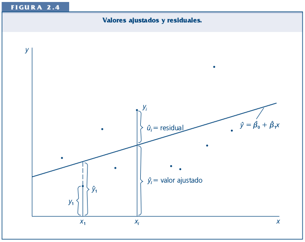

class: bottom, left

```{r setup, include=FALSE, cache = FALSE}
require("knitr")
options(htmltools.dir.version = FALSE)
opts_chunk$set(warning=FALSE,
              message=FALSE,
              echo=TRUE,
              cache = TRUE,fig.width=7, fig.height=5.2)
```

<!---
Para correr en ATOM
- open terminal, abrir R (simplemente, R y }enter)
- rmarkdown::render('12_transform.Rmd', 'xaringan::moon_reader')

About macros.js: permite escalar las imágenes como [scale 50%](path to image), hay si que grabar ese archivo js en el directorio.
--->

.right[]

<br>
<br>
<br>
<br>
<br>
<br>
<br>

# Estadística multivariada, 1 sem. 2019

## Juan Carlos Castillo & Alejandro Plaza

## **Sesión 12**: Transformación de variables

---
class: inverse

https://cran.r-project.org/web/packages/bestNormalize/vignettes/bestNormalize.html
https://cran.r-project.org/web/packages/dlookr/vignettes/transformation.html
http://www.sthda.com/english/articles/40-regression-analysis/162-nonlinear-regression-essentials-in-r-polynomial-and-spline-regression-models/

# Contenidos

## 1. Repaso supuestos

## 2. Transformación

  - Polinomios

  - Logaritmos

  - Centrado

---
class: inverse, middle, center

# 1. Repaso supuestos

---
class: roja, middle, center

## ¿Qué tan eficiente es mi modelo para dar cuenta de las asociaciones entre las variables?


---
# El cuarteto de Anscombe

```{r echo=FALSE}
pacman::p_load(stargazer,tidyverse,gridExtra,ggplot2,gridExtra,broom, car,lmtest,sandwich,interplot,ape,multiwayvcov)
a1<-lm(y1~x1,data=anscombe)
a2<-lm(y2~x2,data=anscombe)
a3<-lm(y3~x3,data=anscombe)
a4<-lm(y4~x4,data=anscombe)
```
.center[
```{r echo=FALSE, }
# 4 nubes de puntos con las rectas de regresión.
F1 <- ggplot(anscombe)+aes(x1,y1)+geom_point()+
geom_abline(intercept=3,slope=0.5)

F2 <- ggplot(anscombe)+aes(x2,y2)+geom_point()+
geom_abline(intercept=3,slope=0.5)

F3 <- ggplot(anscombe)+aes(x3,y3)+geom_point()+
  geom_abline(intercept=3,slope=0.5)

F4 <- ggplot(anscombe)+aes(x4,y4)+geom_point()+
  geom_abline(intercept=3,slope=0.5)

# Mostrar los 4 gráficos en una figura
grid.arrange(F1,F2,F3,F4, ncol = 2)
```
]
---
# El cuarteto de Anscombe

.small[
```{r results='asis', echo=FALSE}
stargazer(a1, a2, a3, a4, type="html", no.space=TRUE,
model.names=FALSE, notes="Errores Estándares en Parentesis",single.row=TRUE)
```
]

---
class: roja

## Por lo tanto:

### No basta con que un beta de regresión sea significativo para poder contrastar adecuadamente las hipótesis

--

### Es necesario revisar la distribución de las asociaciones entre variables y el cumplimiento de supuestos que se encuentran a la base de una estimación de regresión.

---
## ... Recordando: Medias condicionales

.center[

]
---
## ... Recordando: Mínimos cuadrados

.center[

]
---
# Posibles problemas

### - subpredicción

### - sobrepredicción

### - sub o sobre predicción diferenciada según valores de X

---
class: roja

# Detectando problemas

### Revisar VISUALMENTE la distribución de los residuos alrededor de la recta de regresión.

### La forma más eficiente es analizar la relación entre valor predicho (recta) y residuos.

---
## Gráficos de Diagnóstico

.center[

]

---
## Chequeo de supuestos

--
- **Linealidad**: distribución aleatoria de residos alrededor de linea residual=0. .

--

- **Homocedasticidad**: además de aleatoria, los residuos deberían estar distribuidos de manera constante en la banda alrededor de la linea residual=0 para los distintos valores estimados. Formas de abanico, o de embudo indicaría que la varianza de los errores no es constante.

--

- **Normalidad de residuos**

--

- **Observaciones influyentes**: un outlier es una observación que se separa mucho del resto y que puede afectar la estimación

--

- **Multicolinealidad**: asociación estrecha entre predictores


--

(ver cuadro resumen en Guía 8)

---
class: inverse, middle, center

# 2. Transformaciones

---
# Modelos lineales de relaciones no-lineales

### - Uno de los supuestos principales del modelo de regresión es la relación lineal (recta) entre las variables.

--

### - Esta linealidad se expresa en una distribución aleatoria de los residuos en relación a los valores estimados

--

## - ¿Qué sucede en el caso de relaciones no lineales?

--
### - Para poder capturar eficientemente relaciones no lineales entre las variables y evitar la violación de supuestos una alternativa es la TRANSFORMACIÓN de las variables

---
# Ejemplo Relaciones no lineales

.center[

]

## ¿Es posible modelar más apropiadamente esta relación?

---
# Tipos usuales de transformación

## - Polinomial

## - Logarítmica

---
## Transformación polinomial

- Usa regresores que son transformaciones de potencias sucesivas, tales como $X$, $X^2$, $X^3$

.center[

]
---
## Polinomial

$$Y=\beta_0+\beta_{1}X+\beta_{2}X^2$$

- Polinomio cuadrático o de segundo orden, permite una curva en la relación entre X e Y

--

$$Y=\beta_0+\beta_{1}X+\beta_{2}X^2+\beta_{2}X^3$$

- Polinomio cúbico o de tercer orden, permite dos curvas en la relación entre X e Y

--
## Implica que el aumento de una unidad de X tendrá un efecto diferente en Y dependiendo de dónde se encuentra el valor de X

---
# Ejemplo

.large[
- Base de datos `Boston`: incluye variables.

  - `mdev`: valor promedio de las viviendas por barrio

  - `lstat` : porcentaje de personas de bajo estatus

```{r include=FALSE, eval=FALSE}
  setwd("documents/presentaciones/12transform")
```
]

```{r include=FALSE, eval=FALSE}
# Example from http://www.sthda.com/english/articles/40-regression-analysis/162-nonlinear-regression-essentials-in-r-polynomial-and-spline-regression-models/

pacman::p_load(tidyverse,caret)
theme_set(theme_classic())

data("Boston", package = "MASS")

set.seed(123)

training.samples <- Boston$medv %>%
  createDataPartition(p = 0.8, list = FALSE)
train.data  <- Boston[training.samples, ]
test.data <- Boston[-training.samples, ]

boston <-train.data
names(boston)
boston %>% dplyr::select(medv,lstat) -> boston

save(boston, file = "../../data/boston.rda")
```
- Cargar datos: para realizar los ejercicios de esta sesión, cargar los datos así:

```{r, echo=FALSE}
load("../../data/boston.rda")
```

```{r eval=FALSE}
load(url(https://juancarloscastillo.github.io/
metsoc-facsouchile/documents/data/boston.rda))

```

---
## Scatter medv y lstat

```{r fig.width=7, fig.height=5.5}
ggplot(boston, aes(lstat, medv)) +
  geom_point() +
  stat_smooth()
```

---
## Modelo

.pull-left[
```{r}
# modelo
model1 <- lm(medv ~ lstat,
  data = boston)
```
]

.pull-right[
```{r, results='asis', echo=FALSE}
stargazer(model1, type="html",omit.stat = c("rsq", "ser"), dep.var.labels.include = FALSE,dep.var.caption  = "medv")
```
]

---
## Modelo

```{r}
ggplot(train.data, aes(lstat, medv) ) +
  geom_point() +
  stat_smooth(method = lm, formula = y ~ x)
```

---
## Análisis linealidad

- agregar variables para análisis de supuestos a la base de datos

```{r}
boston_s <- broom::augment_columns(model1, boston)
names(boston_s)
```
---
## Análisis linealidad

```{r}
ggplot(boston_s, aes(x=.fitted, y=.resid)) +
  geom_hline(yintercept=0) +
  geom_point() +  geom_smooth(method='loess', se=TRUE)
```

---
## Inclusión de término cuadrático ( $+\beta_{2}lstat^2$ )

.pull-left[

```{r}
model2 <- lm(medv ~ lstat +
  I(lstat^2),
  data = boston)
```
]

.pull-right[.medium[
```{r results='asis', echo=FALSE}
stargazer::stargazer(model1,model2, type="html",omit.stat = c("rsq", "ser"), dep.var.labels.include = FALSE, dep.var.caption  = "medv")
```
]
]
---
## Comparación ajuste modelos

.large[
```{r}
anova(model1,model2)

```

- por lo tanto, se rechaza la hipótesis nula de igualdad de ajuste de los modelos. El modelo con el término cuadrático es significativamente superior al anterior.

]
---
## Análisis residuos vs predichos model2

```{r echo=FALSE}
boston_s2 <- broom::augment_columns(model2, boston)
```

```{r}
ggplot(boston_s2, aes(x=.fitted, y=.resid)) +
  geom_hline(yintercept=0) +
  geom_point() +  geom_smooth(method='loess', se=TRUE)
```

---
## Inclusión de término cúbico ( $+\beta_{3}lstat^3$ )
.medium[
```{r results='asis', echo=FALSE}
stargazer::stargazer(model1,model2,model3, type="html",omit.stat = c("rsq", "ser"), dep.var.labels.include = FALSE, dep.var.caption  = "medv",single.row = TRUE )


```
]
---
## Comparación ajuste modelos

```{r}
anova(model1,model2,model3)

```

- por lo tanto, se rechaza la hipótesis nula de igualdad de ajuste de los modelos. El modelo con el término cúbico es significativamente superior al anterior.


---
## Análisis residuos vs valores predichos model3

```{r echo=FALSE}
boston_s3 <- broom::augment_columns(model3, boston)
```

```{r echo=FALSE}
ggplot(boston_s3, aes(x=.fitted, y=.resid)) +
  geom_hline(yintercept=0) +
  geom_point() +
  geom_smooth(method='loess', se=TRUE)
```

---
## Graficando predicción polinomial cúbica

```{r}
ggplot(boston, aes(lstat, medv) ) +  geom_point() +
  stat_smooth(method = lm, formula = y ~ poly(x, 3, raw = TRUE))
```

---
## Explorando polinomiales

```{r}
lm(medv ~ poly(lstat, 6, raw = TRUE), data = boston) %>% summary()
```

---
class: inverse

# Resumen transformación polinomial

.large[
- alternativa en casos de no linealidad

- agregar polinomios secuencialmente y realizar test de ajuste

- interpretación sustantiva de los efectos

]
---
# Transformación logarítmica

.large[

- Posibilidad adicional de transformación para asociaciones no lineales

- Ej: efecto de ingreso, ¿es lo mismo una diferencia de 100.000 para alguien que gana 400.000 que para alguien que gana 5.000.000?

- La transformación logarítmica permite incorporar mayor "peso" a diferencias en el extremo inferior de la escala.

- Por ejemplo, los logaritmos de 10, 100, y 1,000 son, respectivamente, 1, 2, y3, porque $10^1=10$, $10^2=100$, $10^3=1000$.

]
---
# Transformación logarítmica

.center[


]

---
## Modelo con predictor logarítmico

```{r}
model_log <- lm(medv ~ log(lstat), data = boston)
```

```{r results='asis', echo=FALSE, cache=FALSE}
stargazer(model1, model_log, type="html",omit.stat = c("rsq", "ser"), dep.var.labels.include = FALSE, dep.var.caption  = "medv",single.row = TRUE )
```

---
## Residuos vs valores predichos

.pull-left[

### Original

```{r echo=FALSE}
ggplot(boston_s, aes(x=.fitted, y=.resid)) +
  geom_hline(yintercept=0) +
  geom_point() +
  geom_smooth(method='loess', se=TRUE)
```
]

.pull-right[
### Log
```{r include=FALSE}
boston_log <- broom::augment_columns(model_log, boston)
```

```{r echo=FALSE}
ggplot(boston_log, aes(x=.fitted, y=.resid)) +
  geom_hline(yintercept=0) +
  geom_point() +
  geom_smooth(method='loess', se=TRUE)
```
]


---
## Ajuste regresión log

```{r}
ggplot(boston, aes(lstat, medv) ) +
  geom_point() +
  stat_smooth(method = lm, formula = y ~ log(x))
```

---
class: inverse, middle, center

# Notas sobre centrado de variables

---
## Centrado

.large[
- El centrado de las variables en regresión simple posee consecuencias en el valor del intercepto

- Intercepto: estimación del valor de la variable dependiente cuando los predictores son 0

- La estimación sin centrar en algunos casos puede llevar a algunos problemas en la interpretación de los parámetros del modelo

- El centrado se implementa restando una constante del predictor (usualmente el promedio )
]

---
## Ejemplo centrado regresión simple

### Datos: puntaje en CI y en una escala de felicidad 1-7

.large[
```
> mydata
  felicidad  ci
1         1  	90
2         3  	95
3         4  	98
4         6 	105

lm(formula = felicidad ~ ci)

(Intercept)           ci
-28.5593       0.3305
```
]

--

### **¿Qué significa el valor del intercepto?**

---
## Ejemplo centrado regresión simple

<br>
<br>


---
## Ejemplo centrado regresión simple

.large[
```
> mydata
  felicidad  ci mean_ci cicent_mean cicent_100
1         1  90      97          -7        -10
2         3  95      97          -2         -5
3         4  98      97           1         -2
4         6 105      97           8          5

lm(formula = felicidad ~ cicent_mean)
(Intercept): 3.5000  ; cicent_mean:0.3305

lm(formula = felicidad ~ cicent_100)
(Intercept): 4.4915  ; mydata$cicent_100: 0.3305
```
]
---
## Ejemplo centrado regresión simple

<br>
<br>


---
## Resumen centrado

.large[
- $\beta$ constante en todos los modelos, varı́a solo intercepto

- Modelo sin centrar: intercepto -28,5, felicidad para alguien
con inteligencia 0 (no tiene mucho sentido ...)

- Centrado al promedio: 3.5, estimación de la felicidad para
alguien con inteligencia promedio

- Centrado a 100: 4.49, estimación de la felicidad para alguien
con inteligencia 100
]

---
class: bottom, left

.right[]

<br>
<br>
<br>
<br>
<br>
<br>
<br>

# Estadística multivariada, 1 sem. 2019

## Juan Carlos Castillo & Alejandro Plaza

## **Sesión 12**: Transformación de variables
