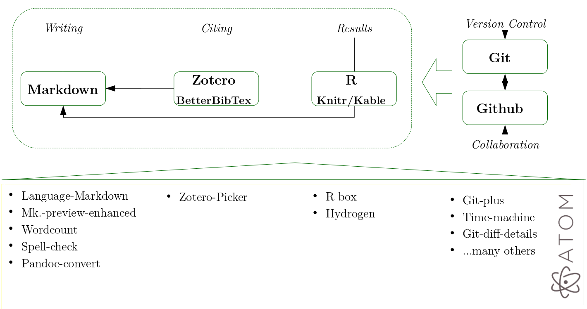

```{r setup, include=FALSE}
options(htmltools.dir.version = FALSE)
```

class: inverse, center, middle


<!--- Para correr en ATOM
- open terminal, abrir R (simplemente, R y enter)
- w
- rmarkdown::render('introRopen.Rmd', 'xaringan::moon_reader')

- knitr
knitr::knit2html("present_panel-alas2018.Rmd")

About macros.js: permite escalar las imágenes como [scale 50%](path to image), hay si que grabar ese archivo js en el directorio--->


# Ciencia Abierta

---

# ¿Es la ciencia realmente abierta?

--

### - Reproducibilidad
--

### - Transparencia
--

### - Colaboración
--

### - Acceso

---
# ¿Cómo investigar y reportar de manera abierta?

--
### - Texto plano (acceso universal independiente de plataformas)

--
### - Flujo de trabajo reproducible (ej: Bowers, 2017 y Healy, 2011)

--
### - Reportes dinámicos (programación literaria)

---
# Ej. Flujo de trabajo reproducible (Healy)


---
# Flujo X(irinGITo)



Más detalles: ver presentación [aquí](https://juancarloscastillo.github.io/jc-castillo/documents/atomworkflow/Xiringito_press.html)

---

class: center, inverse, middle

# R & RStudio

## Herramientas que favorecen la implementación de procedimientos de ciencia abierta en la investigación


---

# R

-   Libre (gratis) & Open source

-   Flexible ("customizable"):  Posibilidad de añadir nuevas funciones (librerías) en expansión constante

-   Permite análisis estadísticos avanzados

-   Posibilidad de importar/leer datos desde diferentes formatos (SPSS,  Stata, SAS, Excel, etc.)

-   Capacidades gráficas avanzadas

-   Disponible para distintos sistemas operativos (Windows, Mac, Linux)

-   Análisis a partir de código en texto plano, favorece documentación y reproducibilidad

- Generación de reportes dinámicos

---

# Google scholar hits


Source: https://i0.wp.com/r4stats.com/wp-content/uploads/2012/04/Fig_2d_ScholarlyImpact.png

---

# Instalación R

-   Visitar la página de CRAN (Comprehensive R Archive Network)
http://cran.r-project.org/ [](https:/cran.r-project.org)

-   Seleccionar versión según sistema operativo (Ej. Windows)

-   Instalar “base”

-   En Windows R GUI (Graphical User Interface) se agrega como interfaz por defecto.

-   Existen otras interfaces gráficas (GUIs) para trabajar con R (R Commander o Java GUI for R (Jaguar), Deducer, R-Studio, etc.)

- RStudio es la más recomendada, principalmente por su expansión de funciones de reportes dinámicos

---
# Instalación RStudio

-   Instalar R Studio: http://www.rstudio.com/

-   Actualización:

    -   Bajar e instalar nueva versión de R

    -   Copiar librerías de carpeta antigua a la nueva

    -   Actualizar librerías (update packages)


---


---
class: center, middle, inverse

# Trabajando en R

--
## Código

--
## Directorio

--
## Librerías

--
## Objetos

---
# Archivo de código / sintaxis

- Tal como en Stata, por defecto los comandos se anotan en un archivo de código desde donde se ejecutan, y que permiten tener respaldo de los análisis

-   Archivo de código simple: File - newfile - Rscript

-   Caracteres especiales

  -   *\#* =Comentarios (AltGr 3) , no se ejecutan

  -   *\+* =Sigue el comando en la próxima línea

  -   *;* =Para escribir más de una función en la misma línea de comandos

- El archivo de código se guarda por defecto con extensión .R, es un archivo de texto simple (plano), que puede ser leído y modificado por cualquier editor.

---
# Directorio de trabajo

-   Por temas de reproducibilidad, se recomienda establecer el directorio de trabajo (donde se buscan y guardan los archivos)

- Especificar al comienzo del archivo de código

```{r eval=FALSE}
 getwd() # obtener directorio de trabajo actual
 setwd("ruta") # : establecer directorio de trabajo
 setwd("C:\Documents and Settings\jcastillo\Mis documentos\proyecto1") # ejemplo
```

---
# Librerías

-   Conjunto de funciones que tienen una relación entre ellas y que  usualmente vienen acompañadas de ficheros de ayuda (documentación)

-   Algunas librerías vienen preinstaladas ("base"), otras específicas hay que instalarlas de acuerdo a las necesidades del usuario

-   Para conocer la lista de librerías instaladas: library()

-   Para instalar:

```{r eval=FALSE}
install.packages(“librería”)
```

-   Las librerías se instalan sólo 1 vez, pero deben ser cargadas si se quieren utilizar en la sesión de trabajo

```{r eval=FALSE}
library(“librería”)
```


-   descripción de librerias por tema (“task views”): https://cran.r-project.org/web/views/

---
## ... librerías

```{r eval=FALSE}
install.packages("lme4")
library("lme4")
? lme4 # ayuda lme4
```

- Para evitar lo de instalar / cargar, hay una librería en R que se llama *pacman* (package manager) que cumple la función de cargar las librerías, y si estas no están instaladas, las instala y las carga.

```{r eval=FALSE}
install.packages("pacman") #solo la primera vez

# Luego
pacman::p_load(librería1, librería2, librería3)
```

---
# Objetos


-   R es un programa orientado a objetos, los que son creados por  funciones, que en su forma más general sería: Objeto = función

-   Diferentes tipos de objetos: vectores, factores, matrices, marco de  datos (entre otros)

-   Objetos simples:

```{r}
# Datos numéricos
 x <- 5 # el número 5 es asignado al objeto x
 x

# Carácter
a <- "hoy"
a
```

---
## Objetos: Vectores

Objeto unidimensional constituido por elementos del mismo tipo

```{r}
edad=c(50,1,25,6)
alumnmos=c("juan", "simon","maria","sonia")
hasta20 <- 1:20 #genera una secuencia de números del 1 al 20
a <- seq (from = -5, to = 5, by = 1.5)
tresdos = rep(2,3)
# Ejemplo de operaciones con vectores numéricos
mean(edad)
summary(edad)
```

---
##Objectos: Factores

Modo que utiliza R para almacenar variables categóricas

```{r}
# crea vector de caracteres
sexo = c(rep("mujer", 4), rep("varon", 10))
sexo
# Para convertir el vector en factor:
sexo = as.factor(sexo)
levels(sexo)
table(sexo)
```

---
##Objetos: Base de datos (dataframe)

-   Estructura más común en R para el análisis de datos

-   Consiste en una matriz donde las columnas pueden tener datos  almacenados en distintos modos , numéricos y categóricos

-   Se pueden concebir como conjuntos de datos donde las líneas representan casos y las columnas variables

-   Las variables pueden ser de distinto tipo, pero todos los datos referidos a una misma variable son del mismo modo


---
class: center, middle, inverse

# Gracias!

(presentación generada con la librería de R  [**xaringan**](https://github.com/yihui/xaringan), de Yihui Xie.

A través de
[remark.js](https://remarkjs.com), [**knitr**](http://yihui.name/knitr), y [R Markdown](https://rmarkdown.rstudio.com).
