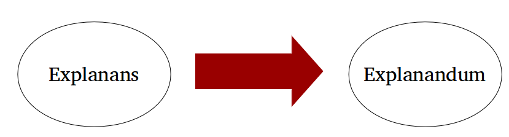
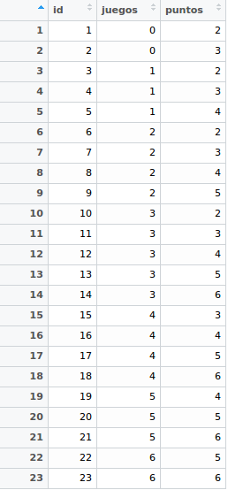
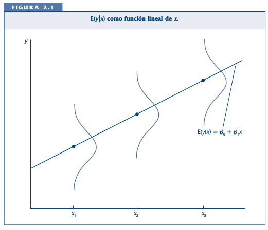

class: bottom, left

```{r setup, include=FALSE, cache = FALSE}
require("knitr")
## setting working directory
options(htmltools.dir.version = FALSE)
#opts_knit$set(root.dir = "/home/juank/Dropbox/cursos 2/facso/multivariada/mulitva2018/sesiones/3regsimp1")
```

<!---
Para correr en ATOM
- open terminal, abrir R (simplemente, R y enter)
- rmarkdown::render('3_regsimp1.Rmd', 'xaringan::moon_reader')

About macros.js: permite escalar las imágenes como [scale 50%](path to image), hay si que grabar ese archivo js en el directorio.
--->

.right[]

<br>
<br>
<br>
<br>
<br>
<br>
<br>

# Estadística multivariada, 1 sem. 2019

## Juan Carlos Castillo & Alejandro Plaza

## **Sesión 3**: Regresión simple 1

---
class: inverse

# Contenidos

## 1. Repaso de sesión anterior

## 2. Regresión simple

## 3. Actividad práctica

---
class: inverse, middle, center

# 1. Repaso sesión anterior

---

# El concepto de explicación en ciencias sociales




  + Explanandum: el fenómeno que predentemos explicar (precisión, relevancia y variabilidad).

  + Explanans: lo que genera la aparición del fenómeno (lógica, eficacia y claridad.)


---
# Dispersión: Varianza

.pull-left[
- Suma de las diferencias al cuadrado de cada valor (x) y el promedio de la distribución divididos por el total menos 1. Formalmente:

$$\sigma^{2}= {\sum_{i=1}^{N}(x_{i}-\bar{x})^{2}\over {N - 1}}$$

- Considerando N-1 para la varianza de la muestra.
]

.pull-right[

| ID   | Pje (x) | $$x-\bar{x}$$ | $$(x-\bar{x})^{2}$$ |
|------|---------|----------|-----------|
| 1    | 6       | 0.4      | 0.16      |
| 2    | 4       | -1.6     | 2.56      |
| 3    | 7       | 1.4      | 1.96      |
| 4    | 2       | -3.6     | 12.96     |
| 5    | 9       | 3.4      | 11.56     |
| Sum  | 28      | 0        | 29.2      |
| Prom | 5.6     |          |           |

$$\sigma^{2}= {(29.2)\over {5 - 1}}$$

.center[**$$ = 7.3$$**]
]

---
# Asociación: covarianza / correlación

¿Se relaciona la variación de una variable, con la variación de otra variable?

.center[]


---
# Asociación: covarianza / correlación (II)

-   Covarianza

    $$cov(x,y) = \frac{\sum_{i=1}^{n}(x_i - \bar{x})(y_i - \bar{y})} {n-1}$$

--

-   Correlación

    $$r= \frac{\sum_{i=1}^{n}(x_i - \bar{x})(y_i - \bar{y})} {(n-1)\sigma_x \sigma_y }$$

--
    O bien

    $$r= \frac{\sum(x-\bar{x})(y-\bar{y})}{\sqrt{\sum(x-\bar{x})^{2} \sum(y-\bar{y})^{2}}}$$


---

# Ejemplo de correlación

Estimar la correlación entre puntaje en lenguaje (x) y puntaje en matemáticas (y):

.left-column[
.small[
| id   | x  | y  | (A) $$x-\bar{x}$$ | (B) $$y-\bar{y}$$ | A*B | $$(x-\bar{x})^{2}$$ | $$(y-\bar{y})^{2}$$ |
|-----:|---:|---:|--------:|--------:|---------:|---------:|---------:|
| 1    | 17 | 24 | -3      | 3       | -9       | 9        | 9        |
| 2    | 19 | 23 | -1      | 2       | -2       | 1        | 4        |
| 3    | 14 | 22 | -6      | 1       | -6       | 36       | 1        |
| 4    | 22 | 17 | 2       | -4      | -8       | 4        | 16       |
| 5    | 15 | 23 | -5      | 2       | -10      | 25       | 4        |
| 6    | 26 | 21 | 6       | 0       | 0        | 36       | 0        |
| 7    | 23 | 18 | 3       | -3      | -9       | 9        | 9        |
| 8    | 21 | 17 | 1       | -4      | -4       | 1        | 16       |
| 9    | 28 | 21 | 8       | 0       | 0        | 64       | 0        |
| 10   | 15 | 24 | -5      | 3       | -15      | 25       | 9        |
| **Sum**  |    |    |         |         | -63      | 210      | 68       |
| Prom | 20 | 21 |         |         |          |          |          |

]
]

.pull-right-narrow[
.left[
$$r= \frac{\sum(x-\bar{x})(y-\bar{y})}{\sqrt{\sum(x-\bar{x})^{2} \sum(y-\bar{y})^{2}}}$$
$$=\frac{-63}{\sqrt{210*68}}$$
$$=-0.5272$$
]
]

---
# Nube de puntos (scatterplot) y correlación

.center[]


---
class: inverse, middle, center

# ¿Preguntas?

---
class: inverse, middle, center

# 2. Modelo de regresión simple

---
## Objetivos centrales del modelo de regresión:

1.Conocer la variación de una variable (dependiente, Y) de acuerdo a la variación  valor de otra variable (independiente, X):

  - _Ej: En qué medida el puntaje PSU influye en el éxito académico en la universidad?_

--

2.Estimar el valor de una variable de acuerdo al valor de otra (predicción)

 - _Ej: Si una persona obtiene 600 puntos en la PSU, que promedio de notas en la universidad es probable que obtenga? (Atención: predicción no implica explicación)_

--

3.Establecer en que medida esta asociación es significativa (inferencia)

  - _¿Se puede generalizar a la población? ¿Con qué nivel de confianza?_

---
# Terminología

.center[]

---
# Ejemplo

### _¿En qué medida la experiencia previa jugando un juego predice el nivel de puntos (en juego posterior)?_

<br>
<br>

.center[]

```{r echo=FALSE, include=FALSE}
datos<- read.csv("practica/golf.txt", sep="")
library(stargazer)
```

---
# Datos
.pull-left[

]

.pull-right[
```{r, echo=FALSE}
pacman::p_load(ggplot2,plotly)
```

```{r, echo=FALSE, fig.height = 6, fig.width = 6}
ggplotly(ggplot(datos, aes(x=juegos, y=puntos)) +
  geom_point() +
  expand_limits(x=c(0,6), y=c(0,6)) + coord_fixed() +
  scale_x_continuous(breaks = seq(min(0), max(6), by = 1)) +
  scale_y_continuous(breaks = seq(min(0), max(6), by = 1)) )
```
]

---
# Descriptivos

<br>
<br>
<br>
<br>

```{r results='asis', echo=FALSE}
stargazer(datos, type = "html")
```


---
# Idea de distribución condicional

.center[]

???
Ejemplo para los sujetos con 1 en X hay 3 valores de Y: 2, 3 y 4. Por lo tanto, la media condicional de Y dado X=1 es 3

---
# Idea de distribución condicional

.center[]

---
# La recta de regresión

La (co) variación general de Y respecto a X se puede expresar en una  ecuación de la recta = modelo de regresión

.center[]

Para obtener la “mejor recta” se utiliza la estimación de mínimos cuadrados (EMC, o **OLS** – Ordinary Least Squares), que minimiza la suma de los cuadrados de las distancias entre las observaciones y la recta en el eje vertical


---
# Componentes de la ecuación de la recta de regresión

$$\widehat{Y}=b_{0} +b_{1}X$$

Donde

- $\widehat{Y}$ es el valor estimado de $Y$

- $b_{0}$ es el intercepto de la recta (el valor de Y cuando X es 0)

- $b_{1}$ es el coeficiente de regresión, que nos dice cuánto aumenta Y por cada punto que aumenta X

---
# Estimación de los coeficientes de la ecuación:

$$b_{1}=\frac{Cov(XY)}{VarX}$$

$$b_{1}=\frac{\frac{\sum_{i=1}^{n}(x_i - \bar{x})(y_i - \bar{y})} {n-1}}{\frac{\sum_{i=1}^{n}(x_i - \bar{x})(x_i - \bar{x})} {n-1}}$$

Y simplificando

$$b_{1}=\frac{\sum_{i=1}^{n}(x_i - \bar{x})(y_i - \bar{y})} {\sum_{i=1}^{n}(x_i - \bar{x})(x_i - \bar{x})}$$

Luego despejando el valor de $b_{0}$

$$b_{0}=\bar{Y}-b_{1}\bar{X}$$

---
# Cálculo basado en el ejemplo

la base para todos estos calculos es la diferencia de cada valor menos su promedio. Vamos a crear un vector en nuestra base de datos $difx=x-\bar{x}$ y $dify=y-\bar{y}$

```{r}
datos$difx=datos$juegos-mean(datos$juegos)
datos$dify=datos$puntos-mean(datos$puntos)
```

Y ahora con esto podemos obtener la diferencia de productos cruzados $dif_cru=(x-\bar{x})*(y-\bar{y})$, así como la suma de cuadrados de X $SSx=(x-\bar{x})^2$

```{r}
datos$dif_cru=datos$difx*datos$dify
datos$SSx=datos$difx^2
```

---
# Datos y vectores (columnas) adicionales

.small[
```{r}
datos
```
]

---
# Cálculo basado en el ejemplo

Y con esto podemos obtener la suma de productos cruzados y la suma de cuadrados de X

```{r}
sum(datos$dif_cru)
sum(datos$SSx)
```

Reemplazando en la fórmula

$$b_{1}=\frac{\sum_{i=1}^{n}(x_i - \bar{x})(y_i - \bar{y})} {\sum_{i=1}^{n}(x_i - \bar{x})(x_i - \bar{x})}=\frac{34}{68}=0.5$$

---
# Cálculo basado en el ejemplo

Reemplazando podemos obtener el valor de $b_{0}$

$$b_{0}=\bar{Y}-b_{1}\bar{X}$$
$$b_{0}=4-(3 * 0.5)=2.5$$

Completando la ecuación:

$$\widehat{Y}=2.5+0.5X$$

Esto nos permite estimar el valor de $Y$ (o su media condicional) basado en el puntaje $X$.
Por ejemplo, cuál es el valor estimado de $Y$ dado $X=3$?

--

$$\widehat{Y}=2.5+(0.5*3)$$

--


$$\widehat{Y}=2.5+(3*0.5)=4$$

---
# Cálculo basado en el ejemplo

.center[
```{r, fig.height = 5, fig.width = 5}
ggplot(datos, aes(x=juegos, y=puntos)) + geom_point() +
  geom_smooth(method=lm, se=FALSE) 
```
]

---
class: inverse, middle, center

# Regresión simple en R

---
# Estimación del modelo de regresión simple en `R`

La función para estimar regresión en `R` es `lm` (linear model). Su forma general es:

```
objeto=lm(dependiente ~ independiente, data=datos)
```

Donde

- objeto: el nombre (cualquiera) que le damos al objeto donde se guardan los resultados de la estimación
- dependiente / independiente: los nombres de las variables en los datos
- data = el nombre del objeto de nuestros datos en R

---
# Estimación del modelo de regresión simple en `R`

En nuestro ejemplo:

```{r}
reg1 <-lm(puntos ~juegos, data = datos)
```

`reg1` es el objeto que almacena la información de nuestra estimación. Para un reporte simple:

```{r}
reg1
```

---
Y en formato más publicable
.small[
```{r, results='asis'}
stargazer(reg1, type = "html")
```
]
---
# Excurso: El cuarteto de Anscombe (1973)

.center[]

---
# Descomponiendo Y

-   Tres piezas de información relevante:

    - Valor observado de Y

    - Estimación de Y a partir de X =( ${Y}^{\prime}$ )

    - Promedio de Y: ( $\bar{Y}$ )

---
# Descomponiendo Y


$$Y=\bar{Y}+({Y}^{\prime}-\bar{Y}) + (Y-{Y}^{\prime})$$

$$ \Sigma(y_i - \bar{y})^2=\Sigma (\bar{y}-\hat{y}_i)^2 + \Sigma(y_i-\hat{y}_i)^2
     $$

---
# Descomponiendo Y

Conceptualmente:

$$SS_{tot}=SS_{reg} + SS_{error}$$


---
# Descomponiendo Y

Por lo tanto:

$$SS_{tot}=SS_{reg} + SS_{error}$$

$$\frac{SS_{tot}}{SS_{tot}}=\frac{SS_{reg}}{SS_{tot}} + \frac{SS_{error}}{SS_{tot}}$$

$$1=\frac{SS_{reg}}{SS_{tot}}+\frac{SS_{error}}{SS_{tot}}$$

$$\frac{SS_{reg}}{SS_{tot}}=R^2$$

---
class: bottom, left

.right[]

<br>
<br>
<br>
<br>
<br>
<br>
<br>

# Estadística multivariada, 1 sem. 2019

## Juan Carlos Castillo & Alejandro Plaza

## **Sesión 3**: Regresión simple 1
