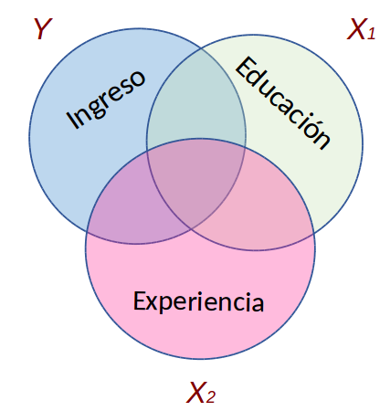
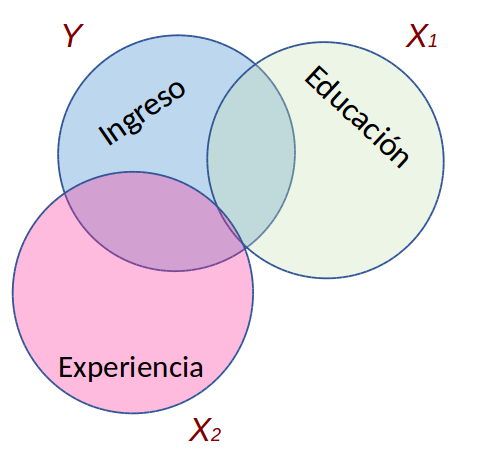

class: bottom, left, exclude

```{r setup, include=FALSE, cache = FALSE}
## setting working directory
options(htmltools.dir.version = FALSE)
#opts_knit$set(root.dir = "/home/juank/Dropbox/cursos 2/facso/multivariada/mulitva2018/sesiones/4regsimp2")
```

<!---
Para correr en ATOM
- open terminal, abrir R (simplemente, R y enter)
- rmarkdown::render('5_regmul1.Rmd', 'xaringan::moon_reader')

About macros.js: permite escalar las imágenes como [scale 50%](path to image), hay si que grabar ese archivo js en el directorio.
--->

.right[]

<br>
<br>
<br>
<br>
<br>
<br>
<br>

# Estadística multivariada, 1 sem. 2019

## Juan Carlos Castillo & Alejandro Plaza

## *Sesión 5* : Regresión múltiple 1


---

layout: true
class: animated, fadeIn

---
class: inverse, bottom, left

# **Contenidos**

## 1. Repaso de sesión anterior

## 2. Introducción a regresión múltiple

## 3. Control estadístico y estimación de coeficientes

---
class: inverse, middle, center

# 1. Repaso sesión anterior

---
# Componentes de la ecuación de la recta de regresión

$$\widehat{Y}=b_{0} +b_{1}X$$

Donde

- $\widehat{Y}$ es el valor estimado de $Y$

- $b_{0}$ es el intercepto de la recta (el valor de Y cuando X es 0)

- $b_{1}$ es el coeficiente de regresión, que nos dice cuánto aumenta Y por cada punto que aumenta X

---
# Resumiendo: Modelo de regresión (simple)

.center[]


- Se estima mediante el método de mínimos cuadrados ordinarios (OLS)

- Permite estimar el valor de una variable ( $\widehat{Y}$ ) a partir del valor conocido de otra variable ( $X$ )

- La estimación se expresa en el coeficiente de regresión $b_{1}$, también llamado "beta" o pendiente

- Este coeficiente se interpreta de la siguiente manera: Por cada unidad que aumenta X, Y aumenta en $b_{1}$ unidades

---
# Descomponiendo Y

Conceptualmente:

$$SS_{tot}=SS_{reg} + SS_{error}$$


---
# Varianza explicada II

.center[]

- Un porcentaje de la variación de Y puede ser asociado a la variación de X:  $R^2$

---
class: inverse

# Resumen regresión simple ... hasta ahora

<br>

### - Coeficiente de regresión por mínimos cuadrados: permite predecir en cuántas unidades aumenta _Y_ por cada punto de aumento en _X_

### - El valor del beta de regresión nos informa sobre una magnitud y sentido de la pendiente, no sobre la bondad (ajuste) del modelo

### - El ajuste del modelo a los datos se relaciona con la proporción de residuos generados por el modelo respecto de la varianza total de Y (_R2_)

---
class: middle, center

# PREGUNTAS

---
class: inverse, middle, center

# 2. Introducción a regresión múltiple


---
# Definiciones

### En simple: modelo de regresión con más de un predictor o variable independiente

.center[]


---
# Agregando predictores al modelo


.pull-left[
.center[]

$$\widehat{Ingreso}=b_0+b_1(Educación)$$

]

--

.pull-right[
.center[]

$$\widehat{Ingreso}=$$
$$b_0+b_1(Educación)+b_2(Experiencia)$$
]


???

- Tenemos un modelo teórico que relaciona ingreso con nivel educacional: a mayor ingreso, mayor nivel educacional.
- Esto puede expresarse en un modelo de regresión
- Qué sucede si nos surge la pregunta sobre la posibilidad de que otras variables también tienen que ver con ingreso?
- Se puede agregar una tercera variable al modelo, pero: ¿qué consecuencias teóricas y empíricas tiene esto?

---
# Agregando predictores al modelo

.pull-left[

.center[]

]

.pull-right[

- Teóricamente el modelo asume covariación entre Ingreso y Educación, y entre _Ingreso_ y _Experiencia_

  - Pero ... también existe la posibilidad de covariación entre los predictores _Educación_ y _Experiencia_

- La covariación de los predictores y su consideración en el modelo se relaciona con el **control estadístico**
{{content}}

]

---
# Concepto de control

## 1. Control por diseño

- Característico de la metodología experimental

- El control se logra por diseño mediante **aleatorización** (al azar) de sujetos a diferentes situaciones experimentales

- La distribución al azar a diferentes situaciones (ej: tratamiento y control) intenta aislar el efecto del tratamiento de todas las otras variables que podrían afectar en la respuesta

---
# Concepto de control

## 2. Control estadístico

- Al analizar datos de encuestas no tenemos (en principio) control por diseño, por lo que se recurre al **control estadístico**

- Se logra incluyendo en el modelo de regresión las variables que teóricamente podrían dar cuenta o afectar la relación entre X e Y.

- La inclusión de otras (co)variables despeja o "controla" la asociación de $X_1$ e $Y$, aislando el efecto conjunto de $X_1$ y $X_2$ (... y $X_n$)

---
# Control estadístico

.pull-left[
- ¿Qué efecto posee el nivel educacional en ingreso, _controlando por_ experiencia?

**Conceptualmente:**

- aislar el efecto de educación en ingreso, manteniendo la experiencia _constante_.

- estimar el efecto de educación en ingreso independiente del efecto de la experiencia

- estimación del efecto de ingreso en educación _ceteris paribus_ (manteniendo el efecto del resto de los predictores constante)
]

.pull-right[
.center[]
]


---
class: inverse, center, middle, exclude

# POR LO TANTO

## Un aspecto **clave** de la regresión múltiple, tanto conceptual como estadísticamente, tiene que ver con el control de la CORRELACION ENTRE PREDICTORES O VARIABLES INDEPENDIENTES (X)

---
# Estimación de parámetros y control

### Ejemplo 1: sin correlación relevante entre predictores

.pull-left[
.center[]
]

--

.pull-right[.medium[
Matriz de correlaciones:
```{r, echo=FALSE,results='hide'}
set.seed(23)
nobs = 100

# Matriz a simular
m<- matrix(c(1.0,0.4,0.2,
             0.4,1.0,0.0,
             0.2,0.0,1.0),nrow=3,ncol=3)

# Cholesky decomposition
l = chol(m)
nvars = dim(l)[1]
r = t(l) %*% matrix(rnorm(nvars*nobs), nrow=nvars, ncol=nobs)
r = t(r)

rdata1 = as.data.frame(r)
names(rdata1) = c('ingreso', 'educacion', 'experiencia')
```

```{r}
m1=cor(rdata1)
round(m1, digits=2)
```
]
]

---
# Estimación de parámetros y control

### Ejemplo 1: sin correlación relevante entre predictores

.pull-left[
.center[]
]

.pull-right[.small[
```{r fig.width=20, fig.height=18}
library(corrplot)
corrplot.mixed(m1, number.cex=6, tl.cex=4)
```
]
]
---
# Estimación de parámetros y control

### Ejemplo 1: sin correlación relevante entre predictores

```{r, echo=FALSE, results="asis", message=FALSE }
r1dat1<-lm(ingreso ~ educacion, data=rdata1)
r2dat1<-lm(ingreso ~ experiencia, data=rdata1)
r3dat1<-lm(ingreso ~ educacion + experiencia, data=rdata1)

library(texreg)
htmlreg(list(r1dat1, r2dat1, r3dat1), booktabs = TRUE, dcolumn = TRUE, doctype = FALSE, caption=" ")
```
---
# Estimación de parámetros y control

### Ejemplo 2: con correlación entre predictores

.pull-left[
.center[]
]

--

.pull-right[.medium[
Matriz de correlaciones:
```{r, echo=FALSE,results='hide'}
set.seed(23)
nobs = 100

## Using a correlation matrix (let' assume that all variables
## have unit variance

m<- matrix(c(1.0,0.5,0.4,
             0.5,1.0,0.3,
             0.4,0.3,1.0),nrow=3,ncol=3)

# Cholesky decomposition
l = chol(m)
nvars = dim(l)[1]


r = t(l) %*% matrix(rnorm(nvars*nobs), nrow=nvars, ncol=nobs)
r = t(r)

rdata2 = as.data.frame(r)
names(rdata2) = c('ingreso', 'educacion', 'experiencia')
```

```{r}
m2=cor(rdata2)
round(m2, digits=2)
```
]
]

---
# Estimación de parámetros y control

### Ejemplo 2: con correlación entre predictores

.pull-left[
.center[]
]

.pull-right[.small[
```{r fig.width=20, fig.height=18}
library(corrplot)
corrplot.mixed(m2,number.cex=6, tl.cex=4)
```
]
]


---
# Estimación de parámetros y control

### Ejemplo 2: con correlación entre predictores

```{r, echo=FALSE, results="asis"}
r1dat2<-lm(ingreso ~ educacion, data=rdata2)
r2dat2<-lm(ingreso ~ experiencia, data=rdata2)
r3dat2<-lm(ingreso ~ educacion + experiencia, data=rdata2)

library(texreg)
htmlreg(list(r1dat2, r2dat2, r3dat2), booktabs = TRUE, dcolumn = TRUE, doctype = FALSE, caption=" ")
```
---
# Estimación de parámetros y control estadístico

- Los coeficientes de regresión (X) no alteran su valor en los modelos en ausencia de correlación entre ellos (Ejemplo 1)

- Si hay correlación entre predictores, el valor de los coeficientes de regresión será distinto en modelos simples y en modelos múltiples

- Por ello, en regresión múltiple se habla de coeficientes de regresión **parciales**

- Esta diferencia se relaciona con el concepto de control estadístico

  - Ejemplo 2, modelo 3: El ingreso aumenta en 0.4 puntos por cada nivel adicional de educación, **controlando por experiencia**. O también ...

      - manteniendo la experiencia _constante_

      - _ceteris paribus_

---
class: inverse

# Resumen

- Regresión múltiple: más de un predictor / variable independiente en el modelo

- Permite

  - contrastar hipótesis de la influencia simultánea de más de una variable

  - controlar por la posible influencia de terceras variables (control estadístico)

- La estimación de los coeficientes de regresión en el caso múltiple se distingue de la simple porque considera la posible correlación entre predictores

---
class: bottom, left, exclude

.right[]

<br>
<br>
<br>
<br>
<br>
<br>
<br>
<br>
<br>
<br>

# Estadística multivariada, 1 sem. 2019

## Juan Carlos Castillo & Alejandro Plaza
