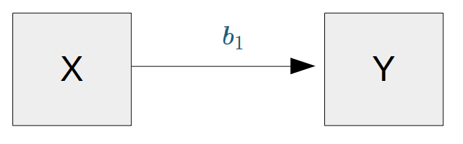

class: bottom, left, exclude

```{r setup, include=FALSE, cache = FALSE}
## setting working directory
options(htmltools.dir.version = FALSE)
#opts_knit$set(root.dir = "/home/juank/Dropbox/cursos 2/facso/multivariada/mulitva2018/sesiones/4regsimp2")
```

<!---
Para correr en ATOM
- open terminal, abrir R (simplemente, R y enter)
- rmarkdown::render('6_regmul2.Rmd', 'xaringan::moon_reader')

About macros.js: permite escalar las imágenes como [scale 50%](path to image), hay si que grabar ese archivo js en el directorio.
--->

.right[]

<br>
<br>
<br>
<br>
<br>
<br>
<br>

# Estadística multivariada, 1 sem. 2019

## Juan Carlos Castillo & Alejandro Plaza

## *Sesión 6* : Regresión múltiple 2


---

layout: true
class: animated, fadeIn

---
class: inverse, bottom, left

# **Contenidos**

## 1. Repaso de sesión anterior

## 2. Bases de control y parcialización

## 3. Significación de coeficientes de regresión

---
class: inverse, middle, center

# 1. Repaso sesión anterior

---
# Base: Modelo de regresión (simple)

$$\widehat{Y}=b_{0} +b_{1}X$$

--
.center[]

--
- Se estima mediante el método de mínimos cuadrados ordinarios (OLS)

--
- Permite estimar el valor de una variable ( $\widehat{Y}$ ) a partir del valor conocido de otra variable ( $X$ )

--
- La estimación se expresa en el coeficiente de regresión $b_{1}$, también llamado "beta" o pendiente

--
- Este coeficiente se interpreta de la siguiente manera: Por cada unidad que aumenta X, Y aumenta en $b_{1}$ unidades


---

# Regresión múltiple: > 1 predictor

$$\widehat{Y}=b_{0}+b_{1}X_{1}+b_{2}X_{2}+b_{3}X_{3}+...+b_{k}X_{k}$$

--

.center[]


---
# Regresión múltiple: > 1 predictor

$$\widehat{Y}=b_{0}+b_{1}X_{1}+b_{2}X_{2}+b_{3}X_{3}+...+b_{k}X_{k}$$

--

.pull-left[
.center[]

$$\widehat{Ingreso}=b_0+b_1(Educ)$$

]

--

.pull-right[
.center[]

$$\widehat{Ingreso}=b_0+b_1(Educ)+b_2(Exp)$$
]

---
# Control de terceras variables

.pull-left[
## 1. Control por diseño

- Característico de la metodología experimental

- Por aleatorización a diferentes situaciones (ej: tratamiento y control)
]

--

.pull-right[

## 2. Control estadístico

- Característico de análisis de datos secundarios (ej: encuestas)

- Se incluyen en el modelo variables que teóricamente podrían dar cuenta o afectar la relación entre X e Y.

- Esto despeja o "controla" la asociación de $X_1$ e $Y$, aislando el efecto conjunto de $X_1$ y $X_2$ (... y $X_n$)
]

---
# Estimación de parámetros y control
.pull-left[.small[
### Ej 1: sin correlación relevante entre predictores
.center[]
]
]

---
# Estimación de parámetros y control

```{r, echo=FALSE,results='hide'}
set.seed(23)
nobs = 100

# Matriz a simular
m<- matrix(c(1.0,0.4,0.2,
             0.4,1.0,0.0,
             0.2,0.0,1.0),nrow=3,ncol=3)

# Cholesky decomposition
l = chol(m)
nvars = dim(l)[1]
r = t(l) %*% matrix(rnorm(nvars*nobs), nrow=nvars, ncol=nobs)
r = t(r)

rdata1 = as.data.frame(r)
names(rdata1) = c('ingreso', 'educacion', 'experiencia')

r1dat1<-lm(ingreso ~ educacion, data=rdata1)
r2dat1<-lm(ingreso ~ experiencia, data=rdata1)
r3dat1<-lm(ingreso ~ educacion + experiencia, data=rdata1)
```
.pull-left[.small[
### Ej 1: sin correlación relevante entre predictores
```{r, echo=FALSE, results="asis", message=FALSE}
library(texreg)
htmlreg(list(r1dat1, r2dat1, r3dat1), booktabs = TRUE, dcolumn = TRUE, doctype = FALSE, caption=" ")
### Ejemplo 1: sin correlación relevante entre predictores
```
]
]
---
# Estimación de parámetros y control
.pull-left[.small[
### Ej 1: sin correlación relevante entre predictores
.center[]
]
]

.pull-right[.small[
### Ejemplo 2: con correlación entre predictores
.center[]
]
]

---
# Estimación de parámetros y control
.pull-left[.small[
### Ej 1: sin correlación relevante entre predictores
```{r, echo=FALSE, results="asis", message=FALSE}
library(texreg)
htmlreg(list(r1dat1, r2dat1, r3dat1), booktabs = TRUE, dcolumn = TRUE, doctype = FALSE, caption=" ")
### Ejemplo 1: sin correlación relevante entre predictores
```
]
]

.pull-right[.small[
### Ejemplo 2: con correlación entre predictores
```{r, echo=FALSE,results='hide'}
set.seed(23)
nobs = 100

## Using a correlation matrix (let' assume that all variables
## have unit variance

m<- matrix(c(1.0,0.5,0.4,
             0.5,1.0,0.3,
             0.4,0.3,1.0),nrow=3,ncol=3)

# Cholesky decomposition
l = chol(m)
nvars = dim(l)[1]


r = t(l) %*% matrix(rnorm(nvars*nobs), nrow=nvars, ncol=nobs)
r = t(r)

rdata2 = as.data.frame(r)
names(rdata2) = c('ingreso', 'educacion', 'experiencia')
```

```{r, echo=FALSE, results="asis"}
r1dat2<-lm(ingreso ~ educacion, data=rdata2)
r2dat2<-lm(ingreso ~ experiencia, data=rdata2)
r3dat2<-lm(ingreso ~ educacion + experiencia, data=rdata2)

htmlreg(list(r1dat2, r2dat2, r3dat2), booktabs = TRUE, dcolumn = TRUE, doctype = FALSE, caption=" ")
```

]
]

---
class: inverse

# RESUMEN

- Los coeficientes de regresión (X) no alteran su valor en los modelos en ausencia de correlación entre ellos (Ejemplo 1)

- Si hay correlación entre predictores, el valor de los coeficientes de regresión será distinto en modelos simples y en modelos múltiples

- Por ello, en regresión múltiple se habla de coeficientes de regresión **parciales**

- Esta diferencia se relaciona con el concepto de control estadístico

  - Ejemplo 2, modelo 3: El ingreso aumenta en 0.4 puntos por cada nivel adicional de educación, **controlando por experiencia**. O también ...

      - manteniendo la experiencia _constante_

      - _ceteris paribus_

---
class: inverse, middle, center

.large[
# PREGUNTAS
]
---
class: inverse, middle, center


# 2. Bases de control y parcialización
---

# Ejemplo: Datos

```{r echo=FALSE, results='hide'}
pacman::p_load(dplyr,
               corrplot,
               ggplot2,
               scatterplot3d,
               texreg,
              stargazer
)
datos=read.csv("ingedexp.csv", sep="")
```


```{r message=FALSE}
stargazer(datos, type="text")
```

---
# Ejemplo: correlaciones

.pull-left[
```{r}
cormat=datos %>% select(ingreso,educacion,experiencia) %>% cor()
round(cormat, digits=2)
```
]

--

.pull-right[
```{r}
corrplot.mixed(cormat)
```
]

---
# Ejemplo: scatters Y / Xs

.pull-left[
**Ingreso <- educación ( $X_1$ )**

```{r echo=FALSE}
ggplot(datos, aes(x=educacion, y=ingreso)) + geom_point() +
  geom_smooth(method=lm, se=FALSE)
```
]

.pull-right[
**Ingreso <- experiencia ( $X_2$ )**

```{r echo=FALSE}
ggplot(datos, aes(x=experiencia, y=ingreso)) + geom_point() +
  geom_smooth(method=lm, se=FALSE)
```
]

---
# Ejemplo: scatter X1 X2

.pull-left[
```{r echo=FALSE}
ggplot(datos, aes(x=educacion, y=experiencia)) + geom_point() +
  geom_smooth(method=lm, se=FALSE)
```
]

.pull-right[
- presencia de correlación entre predictores

- idea de control estadístico: ¿Cuál es la influencia de educación en ingreso, independiente de la experiencia?

- análogo: comparar promedios de ingreso según nivel educacional, para niveles de experiencia similares

- solución estadística: parcialización
]

---
# Regresión


```{r}
reg_y_x1=lm(ingreso ~ educacion, data=datos)
reg_y_x2=lm(ingreso ~ experiencia, data=datos)
reg_y_x1_x2=lm(ingreso ~ educacion + experiencia , data=datos)
```

.medium[
```{r echo=FALSE, results='asis'}
htmlreg(list(reg_y_x1,reg_y_x2,reg_y_x1_x2), booktabs = TRUE, dcolumn = TRUE, doctype = FALSE, caption=" ")
```
]

---
# Parcialización 1

_¿Cómo se despeja la regresión de $Y$ en $X_1$ del efecto de $X_2$?_

.pull-left[
.center[]
]

.pull-right[
.center[]
]

Implica despejar $X_1$ de su correlación con $X_2$, o **parcializar** $X_1$ de $X_2$

---
# Parcialización 3

¿Como obtenemos una variables $X_1$ parcializada de $X_2$?

- Pensemos en que $X_1$ parcializada (de $X_2$ ) es todolo de $X_1$ que no tiene que ver con $X_2$

- En otras palabras, en un modelo donde $X_1$ es la variable dependiente y $X_2$ la independiente, $X_1$ parcializada equivale al **residuo** de esta regresión

.center[]

---
# Parcialización 4

Por lo tanto, para **demostrar** el concepto de parcialización en el ejemplo, los pasos son:

1. Regresión entre predictores

2. Obtención del residuo de la regresión

3. Regresión de $Y$ en el residuo (=la variable parcializada)

Con esto llegaremos a los regresores parciales (que son los que automáticamente aparecen en el output de la regresión múltiple)

---
# Parcialización 5

1.Regresión entre predictores

```{r}
reg_x1_x2=lm(educacion ~ experiencia , data=datos)
reg_x1_x2
```
Por lo tanto, tenemos que nuestro modelo de regresión entre predictores, con educación como dependiente es:

$$\widehat{educacion}=2.66+0.541_{experiencia}$$

---
# Parcialización 6

2.Obtención de residuo (valor estimado - observado)

.medium[

```{r}
x1_fit_x2=fitted.values(reg_x1_x2)
resx1_2=residuals(reg_x1_x2)
datos=cbind(datos, x1_fit_x2,resx1_2); datos
```
]

Ejemplo caso 1: experiencia=1

$$\widehat{educacion}=2.66+0.541*1=3.2$$

Y residuo  $=2-3.2=-1.2$

---
# Parcialización 7

3.Regresión de Y en varaiable $X_1$ parcializada = $X_{1.2}$

```{r}
regy_resx1_2=lm(datos$ingreso ~ resx1_2)
```
.small[
```{r echo=FALSE, results='asis'}
htmlreg(list(reg_y_x1,reg_y_x2,reg_y_x1_x2,regy_resx1_2), booktabs = TRUE, dcolumn = TRUE, doctype = FALSE, caption=" ")
```
]


---
# Parcialización 8

Formulas directas de regresores parciales:

$$b_1=(\frac{s_y}{s_1})(\frac{r_{y1}-r_{y2}r_{12}}{1-r^2_{12}})$$
$$b_2=(\frac{s_y}{s_2})(\frac{r_{y2}-r_{y1}r_{12}}{1-r^2_{12}})$$

---

comparación de scatters con y sin parcializar

---
class: bottom, left, exclude

.right[]

<br>
<br>
<br>
<br>
<br>
<br>
<br>
<br>
<br>
<br>

# Estadística multivariada, 1 sem. 2019

## Juan Carlos Castillo & Alejandro Plaza
