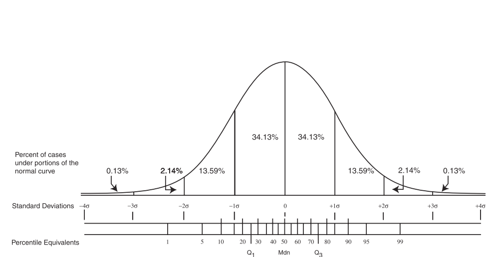
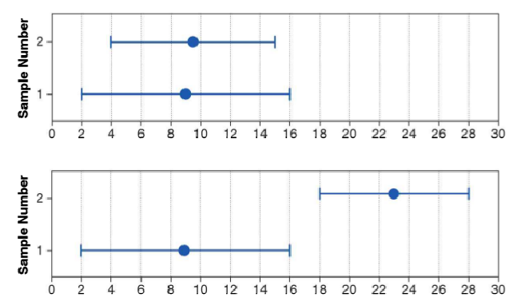

class: bottom, left

```{r setup, include=FALSE, cache = FALSE}
require("knitr")
options(htmltools.dir.version = FALSE)
```

<!---
Para correr en ATOM
- open terminal, abrir R (simplemente, R y enter)
- rmarkdown::render('7_inferencia1.Rmd', 'xaringan::moon_reader')

About macros.js: permite escalar las imágenes como [scale 50%](path to image), hay si que grabar ese archivo js en el directorio.
--->

.right[]

<br>
<br>
<br>
<br>
<br>
<br>
<br>

# Estadística multivariada, 1 sem. 2019

## Juan Carlos Castillo & Alejandro Plaza

## **Sesión 7**: Predictores categóricos e inferencia

---
class: inverse

# Contenidos

## 1. Repaso de sesión anterior

## 2. Predictores Categóricos

## 3. Inferencia Estadística

---
class: inverse, middle, center

# 1. Repaso sesión anterior


---
# Control de terceras variables

.pull-left[
## 1. Control por diseño

- Característico de la metodología experimental

- Por aleatorización a diferentes situaciones (ej: tratamiento y control)
]

--

.pull-right[

## 2. Control estadístico

- Característico de análisis de datos secundarios (ej: encuestas)

- Se incluyen en el modelo variables que teóricamente podrían dar cuenta o afectar la relación entre X e Y.

- Esto despeja o "controla" la asociación de $X_1$ e $Y$, aislando el efecto conjunto de $X_1$ y $X_2$ (... y $X_n$)
]

---
# Estimación de parámetros y control
.pull-left[.small[
### Ej 1: sin correlación relevante entre predictores
.center[]
]
]

---
# Estimación de parámetros y control

```{r, echo=FALSE,results='hide', warning=FALSE}
set.seed(23)
nobs = 100

# Matriz a simular
m<- matrix(c(1.0,0.4,0.2,
             0.4,1.0,0.0,
             0.2,0.0,1.0),nrow=3,ncol=3)

# Cholesky decomposition
l = chol(m)
nvars = dim(l)[1]
r = t(l) %*% matrix(rnorm(nvars*nobs), nrow=nvars, ncol=nobs)
r = t(r)

rdata1 = as.data.frame(r)
names(rdata1) = c('ingreso', 'educacion', 'experiencia')

r1dat1<-lm(ingreso ~ educacion, data=rdata1)
r2dat1<-lm(ingreso ~ experiencia, data=rdata1)
r3dat1<-lm(ingreso ~ educacion + experiencia, data=rdata1)
```
.pull-left[.small[
### Ej 1: sin correlación relevante entre predictores
```{r, echo=FALSE, results="asis", warning=FALSE, message=FALSE}
library(texreg)
htmlreg(list(r1dat1, r2dat1, r3dat1), booktabs = TRUE, dcolumn = TRUE, doctype = FALSE, caption=" ")
### Ejemplo 1: sin correlación relevante entre predictores
```
]
]
---
# Estimación de parámetros y control
.pull-left[.small[
### Ej 1: sin correlación relevante entre predictores
.center[]
]
]

.pull-right[.small[
### Ejemplo 2: con correlación entre predictores
.center[]
]
]

---
# Estimación de parámetros y control
.pull-left[.small[
### Ej 1: sin correlación relevante entre predictores
```{r, echo=FALSE, results="asis", warning=FALSE, message=FALSE}
library(texreg)
htmlreg(list(r1dat1, r2dat1, r3dat1), booktabs = TRUE, dcolumn = TRUE, doctype = FALSE, caption=" ")
### Ejemplo 1: sin correlación relevante entre predictores
```
]
]

.pull-right[.small[
### Ejemplo 2: con correlación entre predictores
```{r, echo=FALSE, warning=FALSE,results='hide'}
set.seed(23)
nobs = 100

## Using a correlation matrix (let' assume that all variables
## have unit variance

m<- matrix(c(1.0,0.5,0.4,
             0.5,1.0,0.3,
             0.4,0.3,1.0),nrow=3,ncol=3)

# Cholesky decomposition
l = chol(m)
nvars = dim(l)[1]


r = t(l) %*% matrix(rnorm(nvars*nobs), nrow=nvars, ncol=nobs)
r = t(r)

rdata2 = as.data.frame(r)
names(rdata2) = c('ingreso', 'educacion', 'experiencia')
```

```{r, echo=FALSE, warning=FALSE, results="asis"}
r1dat2<-lm(ingreso ~ educacion, data=rdata2)
r2dat2<-lm(ingreso ~ experiencia, data=rdata2)
r3dat2<-lm(ingreso ~ educacion + experiencia, data=rdata2)

htmlreg(list(r1dat2, r2dat2, r3dat2), booktabs = TRUE, dcolumn = TRUE, doctype = FALSE, caption=" ")
```

]
]

---
class: inverse

# RESUMEN

- Los coeficientes de regresión (X) no alteran su valor en los modelos en ausencia de correlación entre ellos (Ejemplo 1)

- Si hay correlación entre predictores, el valor de los coeficientes de regresión será distinto en modelos simples y en modelos múltiples

- Por ello, en regresión múltiple se habla de coeficientes de regresión **parciales**

- Esta diferencia se relaciona con el concepto de control estadístico

  - Ejemplo 2, modelo 3: El ingreso aumenta en 0.4 puntos por cada nivel adicional de educación, **controlando por experiencia**. O también ...

      - manteniendo la experiencia _constante_

      - _ceteris paribus_


---
class: inverse, middle, center

# 2. Predictores Categóricos


---

## Variables categóricas


- Hasta el momento sólo hemos considerado variables explicativas de niveles continuos o intervalares.

- A menudo, las variables explicativas son categóricas.

--

###Variables binarias / dicotómicas
- Hombre, Mujer
- Vivo, Muerto
- Votó, No Votó.

--

###Variables politómicas:
- Básica, Medía, Técnica, Universitaria
- Frente Amplio, Nueva Mayoría, Chile Vamos, No interesado.

---

## Variables categóricas

- Pensemos que queremos predecir el ingreso de una persona, a partir de una variable $X$, que expresa el sexo de una persona


$$X=1(Mujer)$$
$$X=0(Hombre)$$

--
El coeficiente $\beta$ es la diferencia esperada de $Y$ (ingreso) entre hombres y mujeres.

Para las mujeres: $Y=\alpha +\beta X= \alpha+\beta$

Para los hombres: $Y=\alpha +\beta X= \alpha$

Diferencia      : $\beta$

Podemos usar la misma idea básica para incluir variables explicativas binarias y catégoricas en los modelos de regresión múltiple.

---

## Variables categóricas: Ejemplo

Basandonos en Castillo, Miranda y Madero (2013), intentaremos explicar el estatus social subjetivo en base a la encuesta ELSOC.

--

### Variable dependiente

En nuestra sociedad, hay grupos que tienden a ubicarse en los niveles más altos y grupos que tienden a ubicarse en los niveles más bajos de la sociedad.  ¿Dónde se ubicaría usted en la sociedad chilena?

  -Likert de 0 a 10 donde 0 "El nivel más bajo" y 10 "El nivel más alto"

### Variables independientes

- Ingreso
- Edad
- Sexo (Hombre=0; Mujer=1)

---

## Ejemplo estimación

```{r echo=F, warning=FALSE, message=FALSE,results='asis' }
library(haven)
library(sjmisc)
library(car)
library(texreg)

elsoc <- read_dta("ELSOC_W01_v2.00_Stata13.dta")
elsoc[elsoc==-999 | elsoc==-888] <- NA

elsoc$sexo<- as.factor(car::recode(elsoc$m0_sexo, "1='Hombre'; 2='Mujer'"))
elsoc$ed<- as.factor(elsoc$m01)
elsoc$edu<- car::recode(elsoc$ed, "10 ='Universitaria';1:3='Básica'; 4:5='Media'; 6:7='Tecnica Superior'; 8:9 ='Universitaria'")
elsoc$edu<- as.factor(elsoc$edu)

#
modelo1<- lm(d01_01 ~ m0_edad+m29+sexo, data=elsoc)
modelo2<- lm(d01_01 ~ m0_edad+m29+sexo+edu, data=elsoc)


htmlreg(modelo1, custom.model.names = "Estatus Social Subjetivo", # Cambiar nombre del título
       custom.coef.names = c("Intercepto", "Edad", "Ingreso", "Mujer"),   #Cambiar nombre de las variables
       custom.note = "Elaboración propia en base a Elsoc", #Agregar una nota
       single.row = T, #para que la DS este en una linea
       booktabs = TRUE, dcolumn = TRUE, doctype = FALSE)
#

```

Este resultado implica que las mujeres (sexo=1) obtienen 0.13 puntos promedios menos **en relación** a los hombres (sexo=0) en la variable de estatus social subjetivo, manteniendo las otras variables constantes.

---
## Más de dos categorías

- ¿Qué sucede cuando quiero predecir el estatus social subjetivo en base una variable catégorica con más de dos valores? (ej. Educación, Clase Social, Posición política).

- La solución estándar es convertir esta variable en un conjunto de variables binarias o variables "dummy".

- El conjunto de éstas variables dummy dan lugar a la variable categórica completa.

---

## Especificando el conjunto de variables dummy.

- Las variables dummy son **todas las categorías menos una** de una variable categórica incluida en el modelo.

- La categoría que no tiene una variable dummy es la **Referencia**, que jugará un rol de línea base en el análisis.

- El coeficiente de la variable dummy es la diferencia esperada en la variable dependiente $Y$ entre la categoría y la categoría de referencia.

  - Las diferencias entre las categorías no de referencia están dadas por las diferencias entre sus coeficientes.

- La decisión de la categorías de referencia es arbitraria: el modelo es el mismo de cualquier forma.

---

## Especificando el conjunto de variables dummy.

- En este ejemplo la variable educación esta expresada en un conjunto de variables $X$ media, técnica y universitaría, siendo la categoría básica la categoría de **referencia**:


|                 | $X_{media}$ | $X_{tecnica}$ | $X_{universitaria}$ |
|------------------|---------|------------|-----------------|
| Básica           | 0       | 0          | 0               |
| Media            | 1       | 0          | 0               |
| Técnica Superior | 0       | 1          | 0               |
| Universitaria    | 0       | 0          | 1               |

$$Y_{ingreso} = \beta_{0}+\beta_{1}X_{media}+\beta_{2}X_{tecnica}+\beta_{3}X_{universitaria}$$


---

.pull-left[
### Resumen
.medium[
- Podemos incluir variables explicativas categóricas incluyéndolas en el modelo como un conjunto de variables dicotómicas 1/0 (dummy).

- Una variable binaria por cada categoría, excepto por una **categoría de referencia**.

- La interpretación de los coeficientes es la diferencia en promedio entre la categoría y la categoría de referencia, manteniendo el resto de las variables constantes.

- La selección de la categoría de referencia suele ser arbitraria y no genera una diferencia sustantiva en el modelo, pero ojo que determina cual es la unidad de agrupamiento y por ende su interpretación.
]
]


.pull-right[
### Modelo de regresión lineal:

.small[
```{r echo=F, warning=FALSE, message=FALSE,results='asis'}
htmlreg(list(modelo1, modelo2), #custom.model.names = "Estatus Social Subjetivo", # Cambiar nombre del título
       #custom.coef.names = c("Intercepto", "Edad", "Ingreso", "Mujer"),   #Cambiar nombre de las variables
       custom.note = "Elaboración propia en base a Elsoc", #Agregar una nota
       single.row = T, #para que la DS este en una linea
       booktabs = TRUE, dcolumn = TRUE, doctype = FALSE)
#
```
]
]

---
class: inverse, middle,center

# PREGUNTAS


---
class: inverse, middle, center

# 3. Inferencia Estadística

---

# Conceptos claves de inferencia

.pull-left[
- La inferencia en estadística se refiere a la relación que existe entre los resultados obtenidos basados en nuestra muestra y la población:


- ### ¿En qué medida podemos hacer inferencias desde nuestra muestra a la población?

- Un concepto central en esto es el **ERROR** y su cuantificación
]


.pull-right[


]

---
# Error estándar

- Asumimos que nuestra estimación se basa en una muestra, y que podría variar si hubiera sido calculado en una muestra distinta

- Por lo tanto, existe una variación muestral del promedio (u otro estadístico), y una desviación muestral también. La desviación muestral se conoce como el **error estándar**.

- Basados en demostraciones estadísticas, en muestras mayores a 30 esta distribución muestral se aproxima a una distribución normal, con un promedio igual al promedio de la población y una desviación estándar de:

$$\sigma_{\bar{X}}=\frac{s}{\sqrt{N}}=SE(error estándar)$$

- Esto se conoce como el teorema del límite central, que nos dice que mediante esta ecuación podemos obtener el error estándar del promedio.

---
# Error, probabilidad e intervalos

- El error estándar nos permite establecer un intervalo de posibles valores para nuestra estimación

- Para ello nos basamos en una función teórica de distribución que es la curva normal

.center[]

---
# Error, probabilidad e intervalos

- Dentro de las propiedades de la curva normal sabemos que el 68% de los casos se encuentran a +/- 1 SD del promedio, y el 95% a +/- 1.96 SD

- En base a esto, por ejemplo si tenemos una muestra de 50 bebes, estatura $\bar{X}=64cm$ , y desviación estándar $\sigma=4$:

$$SE=\frac{4}{\sqrt{50}}=0.56$$

- 64 +/- 0.56 nos da un intervalo de 63.43-64.56, donde se encuentra el 68% de la población
- Si sumamos +/- 1.96 SE (1.09) nos da un intervalo de 62,91 - 65.09 de estatura donde se encuentra el 95% de los bebes

---
# Prueba de hipótesis

  - La prueba de hipótesis tiene como elemento central formular una hipótesis nula, la cual indica que no hay diferencias entre medias o que la correlación/coeficiente de regresión es igual a cero.

    - El rechazo de hipótesis tiene que ver con el concepto de **probabilidad** y error (estándar)

    _Ej: ¿con qué nivel de probabilidad puedo decir que existen diferencias entre hombres y mujeres en rendimiento en matemáticas?_

  - Por lo tanto, el elemento central en la prueba de hipótesis es establecer es la probabilidad de error que estamos cometiendo en la inferencia

---
# Inferencia sobre diferencias entre grupos

- ¿Son distintos los promedios de dos grupos?

.center[]

- En términos generales, se puede rechazar la hipótesis nula con un cierto nivel de confianza cuando los intervalos no se tocan
- ... o en otras palabras, cuando las diferencias son estadísticamente distintas de 0.

---
# Prueba de hipótesis

.pull-left[
Para hacer frente a esta situación, se establecen dos tipos de hipótesis:

- Hipótesis nula ( $H_{0}$ ): no existen diferencias
- Hipótesis alternativa ( $H_{a}$ ): existen diferencias


]
--

.pull-right[
¿Tiene el entrenamiento en matemáticas un impacto en mayor puntaje SIMCE?

$$H_{0}: \mu_{0}=\mu_{1} \vee \mu_{entren}=\mu_{pob}$$

$$H_{a}: \mu_{0}>\mu_{1} \vee \mu_{entren}>\mu_{pob}$$
- Se usa 5% como convención para rechazar la hipótesis nula. Si no hay significación, se falla en rechazar la hipótesis nula.

- El test de hipótesis se asocia a valores de probabilidad, cuyos resultados esperados son p<0.05 ,p<0.01 o p<0.001

]

---

## Prueba de hipótesis

Para el caso del modelo de regresión lineal

$$y= \beta_{0}+\beta_{1}X_{1} +...+ \beta_{k}X_{k} + u$$

$\beta$ es una característica desconocida de la población, que nunca se conocerá con certeza.

No obstante, es posible hacer una prueba de hipótesis acerca el valor de $\beta$ y después usar la inferencia estadístisca para probarla.

---

## Prueba de hipótesis

A partir de lo anterior, el interés principal reside en probar la **hipótesis nula**:

$$H_{0}: \beta_{j} = 0$$
donde $j$ corresponde a cualquiera de las $k$ variables independientes.

Esta hipótesis implica que una vez que $x_{1}, x_{2},..,x_{k}$ han sido tomadas en cuenta, $x_{j}$ no tiene **ningún** efecto sobre el valor esperado de $y$.
---

## Prueba de hipótesis

Entonces contrastamos la *hipótesis nula*:

$$H_{0}: \beta_{j} = 0$$

En relación a la siguiente hipótesis alternativa:

$$H_{a}: \beta_{j} \neq 0$$
Lo que implica que:

$H_{0}$: **No** hay asociación lineal entre el predictor $X$ y la variable $Y$ en la población.


$H_{a}$: **Hay** asociación lineal entre el predictor $X$ y la variable $Y$ en la población.


---

## Prueba de hipótesis para $\beta{j}$

.pull-left[

- La mayoría de los programas estadísticos incluyen el error estándar de $\beta{j}$ o $SE(\beta{j})$.

- $SE(\beta{j})$ estima la desviación estándar de la distribución muestral de $\beta{j}$, cuando se toma una muestra aleatoria de tamaño N de una población y se estima un modelo de regresión lineal.

- Además se incluye el estadístico $t$ el cual tiene una correspondencia con el valor p que cuantifica la probabilidad de obtener un valor de $\beta{j}$ diferente de 0.

]

--
.pull-right[.small[
```{r}
round(summary(modelo2)$coefficients[,1:2],2)
round(summary(modelo2)$coefficients[,3:4],2)
#N=2337
```
]
]

---
# Inferencia, diferencias y prueba _t_

- La prueba _t_ se utiliza para inferencias sobre diferencias entre grupos, y básicamente es una razón entre

.center[]

- Ya que la diferencia esperada si $H_0$ es verdadera es 0, entonces es la diferencia observada dividida por el error estándar de la diferencia entre los promedios:

$$t=\frac{b_j}{SE(b_j)}$$


---
## Prueba de hipótesis

$$ t = \frac{\hat{\beta_{j}}-0}{SE(\hat{\beta{j}})} $$

Esto implica una distribución muestral t con $(n-k-1)$ grados de libertad. Con los grados de libertad obtenemos el valor p.

En el ejemplo anterior, para el coeficiente de Educación Universitaria:

$t=\frac{1.37-0}{0.10}=13.19$

Entonces, con  $t=13.19$ y  grados de libertad = 2330 (GL=2337-6-1=2330), obtenemos un valor p < 0.001, lo que implica que con un 99% de confianza podemos rechazar la hipótesis nula de que $\beta_{eduUniversitatia}=0$.


---
# Inferencia, diferencias y prueba _t_

Siendo $SE(b_j)$ el error estándar de la diferencia entre los promedios (o medias condicionales). Pensemos para el caso simple de una variable dicotómica:

$$se_{diff}=\sqrt{\frac{\sigma_{diff}}{n_a}+\frac{\sigma_{diff}}{n_b}}$$

- Para lo cual se requiere calcular la desviación estandar de la diferencia:

$$\sigma_{diff}=\frac{\sigma^2_{a}(n_a-1)+\sigma^2_{b}(n_b-1)}{n_a+n_b-2}$$

- Al dividir el coeficiente por el error estándar se obtiene el valor t, que luego se contrasta con el valor crítico según los grados de libertad N-k-1 (siendo k el número de regresores)

---

## Intervalos de confianza

Los **Intervalos de Confianza** proporcionan un rango de valores posibles para el parámetro poblacional y no sólo una estimación puntual.

Empleando el hecho de que $(\hat{\beta_{j}}-0)/SE(\hat{\beta{j}})$ tiene una distribución $t$ con $n-k-1$ grados de libertad,se puede obtener un intervalo de confianza (IC) a partir de:

$$IC=\beta_{j}\pm c*SE(\hat{\beta{j}})$$
donde $c$ representa el percentil en la distribución $t_{n-k-1}$.La selección del percentil, depende del nivel de confianza que se quiere estimar y si la prueba de hipótesis es a una o dos colas.


---
## Intervalos de confianza

Calculamos el intervalo de confianza del $\beta$ de educación sobre ingreso. Sabemos que este es igual a 1.37

En este caso, estimamos el intervalo al 95% de confianza a dos colas, obtenemos lo siguiente:

$$LimiteSuperior= 1.368 + 1.9609*0.1037=1.57$$
$$LimiteInferior= 1.368 - 1.9609*0.1037=1.17$$
Como se puede observar en ninguno de los límites el $\beta$ "atraviesa" el cero, por lo que se puede rechazar con el 95% de confianza que $\beta \neq 0$

---

## Intervalos de confianza en R

.pull-left[.small[
```{r}
#Beta de educacion
BeducS<- summary(modelo2)$coefficients[7]
BeducS
#Error Estandár de Beta de educación.
SE_BeducS <- summary(modelo2)$coefficients[7,2]
SE_BeducS
#C 95% de confianza o alfa 0.5 a dos colas
c<- qt(0.975, df=2330)
c
```

]
]
--
.pull-right[.small[
```{r}

#Cálculo del limite de confianza
Limit_Superior<- BeducS + c*SE_BeducS
Limit_Inferior<- BeducS - c*SE_BeducS
c(Limit_Inferior,Limit_Superior)
# o en un comando
confint(modelo2)[7,]
#Y al 99% a dos colas
confint(modelo2, level = 0.99)[7,]
```
]
]

---
## Visualización  de intervalos de confianza

```{r echo=FALSE, warning=FALSE, message=FALSE}
library(ggplot2)
library(coefplot)
coefplot::coefplot(modelo2) +
  scale_y_discrete(name=" ", limits=c("(Intercept)","m0_edad","m29","sexoMujer","eduMedia","eduTecnica Superior", "eduUniversitaria"),
                   labels=c("Intercepto", "Edad","Ingreso","Mujer","Media","Tecnica Superior", "Universitaria")) +
  scale_x_continuous(name = " ") +
  ggtitle("Gráficos de Coeficientes Beta")+
  theme_bw()
```

---
class: inverse, middle

# RESUMEN

- Inferencia estadística: de la muestra a la población

- Basada en cálculo del error e intervalos de confianza

- En concreto: $\Beta_j/SE=t$, donde _t_ se asocia a un nivel de probabilidad que luego permite decidir sobre el rechazo a la hipótesis nula


---
class: bottom, left

.right[]

<br>
<br>
<br>
<br>
<br>
<br>
<br>

# Estadística multivariada, 1 sem. 2019

## Juan Carlos Castillo & Alejandro Plaza

## **Sesión 7**: Inferencia Estadística
