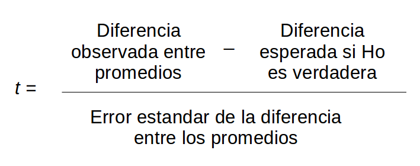

class: bottom, left

```{r setup, include=FALSE, cache = FALSE}
require("knitr")
options(htmltools.dir.version = FALSE)
```

<!---
Para correr en ATOM
- open terminal, abrir R (simplemente, R y enter)
- rmarkdown::render('8_compmodel.Rmd', 'xaringan::moon_reader')

About macros.js: permite escalar las imágenes como [scale 50%](path to image), hay si que grabar ese archivo js en el directorio.
--->

.right[]

<br>
<br>
<br>
<br>
<br>
<br>
<br>

# Estadística multivariada, 1 sem. 2019

## Juan Carlos Castillo & Alejandro Plaza

## **Sesión 8**: Interpretación y comparación de modelos

---
class: inverse

# Contenidos

## 1. Repaso de sesión anterior

## 3. Inferencia Estadística (continuación)

## 4. Comparación ajuste de modelos

## 5. Comparación de variables independientes

---
class: inverse, middle, center

# 1. Repaso sesión anterior


---
## Predictores categóricos dicotómicos

- Pensemos que queremos predecir el ingreso de una persona, a partir de una variable $X$ dicotómica o _dummy_, que expresa el sexo de una persona

$$X=1(Mujer)$$
$$X=0(Hombre)$$

--
Sustituyendo en la ecuación de regresión:

- Para las mujeres: $Y=\alpha +\beta X= \alpha+\beta$

- Para los hombres: $Y=\alpha +\beta X= \alpha$

--

### El coeficiente $\beta$ expresa las diferencias promedio en $Y$ (ej: ingreso) entre los grupos.

---
## Predictores categóricos múltiples (politómicos)

- Extensión del caso dicotómico

  - se transforman todas las categorías a variables _dummy_

  - una de las categorías se deja fuera del modelo de regresión y se utiliza como referencia para la interpretación

--

|                 | $X_{media}$ | $X_{tecnica}$ | $X_{universitaria}$ |
|------------------|---------|------------|-----------------|
| Básica           | 0       | 0          | 0               |
| Media            | 1       | 0          | 0               |
| Técnica Superior | 0       | 1          | 0               |
| Universitaria    | 0       | 0          | 1               |

$$Y_{ingreso} = \beta_{0}+\beta_{1}X_{media}+\beta_{2}X_{tecnica}+\beta_{3}X_{universitaria}$$

---
.pull-left[
### Resumen categóricos
.medium[
- Podemos incluir variables explicativas categóricas incluyéndolas en el modelo como un conjunto de variables dicotómicas 1/0 (dummy).

- Una variable binaria por cada categoría, excepto por una **categoría de referencia**.

- La interpretación de los coeficientes es la diferencia en promedio entre la categoría y la categoría de referencia, manteniendo el resto de las variables constantes.

- La selección de la categoría de referencia suele ser arbitraria y no genera una diferencia sustantiva en el modelo, pero ojo que determina cual es la unidad de agrupamiento y por ende su interpretación.
]
]


.pull-right[
### Modelo de regresión lineal:

.small[
```{r echo=F, warning=FALSE, message=FALSE,results='hide'}
library(haven)
elsoc <- read_dta("../7inferencia/ELSOC_W01_v2.00_Stata13.dta")

elsoc[elsoc==-999 | elsoc==-888] <- NA

elsoc$sexo<- as.factor(car::recode(elsoc$m0_sexo, "1='Hombre'; 2='Mujer'"))
elsoc$ed<- as.factor(elsoc$m01)
elsoc$edu<- car::recode(elsoc$ed, "10 ='Universitaria';1:3='Básica'; 4:5='Media'; 6:7='Tecnica Superior'; 8:9 ='Universitaria'")
elsoc$edu<- as.factor(elsoc$edu)

modelo1<- lm(d01_01 ~ m0_edad+ m29 +sexo, data=elsoc)
modelo2<- lm(d01_01 ~ m0_edad+ m29 +sexo+edu, data=elsoc)

library(texreg)
```
```{r echo=F, warning=FALSE, message=FALSE,results='asis'}
htmlreg(list(modelo1, modelo2),
        custom.model.names = c("Modelo 1", "Modelo 2"),
        custom.coef.names = c("Intercepto", "Edad", "Ingreso", "Mujer", "Media","Técnica","Universitaria"),   #Cambiar nombre de las variables
        include.f=TRUE,
        include.rmse=FALSE,
        custom.note = "%stars., errores estándar en paréntesis",
        caption=" ",
        #single.row = T, #para que la DS este en una linea
        booktabs = TRUE, dcolumn = TRUE, doctype = FALSE)
```
]
]

---

## Inferencia: Prueba de hipótesis

Contraste de la *hipótesis nula*:

$$H_{0}: \beta_{j} = 0$$

En relación a la siguiente hipótesis alternativa:

$$H_{a}: \beta_{j} \neq 0$$
Lo que implica que:

$H_{0}$: **No** hay asociación lineal entre el predictor $X$ y la variable $Y$ en la población.

$H_{a}$: **Hay** asociación lineal entre el predictor $X$ y la variable $Y$ en la población.

---
## Inferencia, diferencias y prueba _t_

- La prueba _t_ se utiliza para inferencias sobre diferencias entre grupos, y básicamente es una razón entre

.center[]

--

- Ya que la diferencia esperada si $H_0$ es verdadera es 0, entonces es la diferencia observada dividida por el error estándar de la diferencia entre los promedios:

$$t=\frac{b_j}{SE(b_j)}$$

--

- Luego este estadístico se contrasta con los valores críticos de la tabla _t_, para el nivel de confianza establecido (usualmente a 95% o 99%).

---
## Inferencia y tabla de regresión

.pull-left[.small[

```{r echo=F, warning=FALSE, message=FALSE,results='asis'}
htmlreg(modelo1,
        custom.model.names = c("Modelo 1"),
        custom.coef.names = c("Intercepto", "Edad", "Ingreso", "Mujer"),   #Cambiar nombre de las variables
        include.f=TRUE,
        include.rmse=FALSE,
        custom.note = "%stars., errores estándar en paréntesis",
        caption=" ",
        #single.row = T, #para que la DS este en una linea
        booktabs = TRUE, dcolumn = TRUE, doctype = FALSE)
```
]]

.pull-right[
- En la tabla lo que aparece en paréntesis bajo los $\beta$ es usualmente el Error Estándar $SE(b_j)$

- El estadístico _t_ se obtiene entonces dividiendo $\beta$ por su $SE(b_j)$, y a esto se asocia un nivel de confianza para la probabilidad de error del rechazo de $H_0$, que se refleja en las estrellas, usualmente ``*p<0.1; **p<0.05; ***p<0.01`

]
---
## Inferencia e Intervalos de confianza

- Los **Intervalos de Confianza** proporcionan un rango de valores posibles para el parámetro poblacional.

- Este rango nos permite reflejar en qué medida el $\beta$ es estadísticamente distinto de 0 para un cierto nivel de confianza

- El rango se construye sumando y restando un Error Estándar ponderado

$$IC=\beta_{j}\pm c*SE(\hat{\beta{j}})$$
donde $c$ representa el percentil en la distribución $t_{n-k-1}$.

- El ponderador $c$ depende de
  - 1) el nivel de confianza con el cual queramos construir el intervalo, y
  - 2) si la hipótesis es direccional o bidireccional.

Con esta información se obtiene el valor critico de la tabla de valores _t_ (o automáticamente en con la función `confint`)

---
## Ejemplo intervalo de Confianza

- Nos interesa el efecto de educación universitaria($\beta$) en ingreso, y tenemos que:
-
  - $\beta$=1.368
  - $SE$=0.1037
  - Ponderador: valor crítico de _t_ para p<0.025 (0.05/2 por hipótesis bidireccional), con N-k-1 (N=2,337, k regresores=6) df: 2,330=1,9609

En este caso, estimamos el intervalo al 95% de confianza a dos colas, obtenemos lo siguiente:

$$LimiteSuperior= 1.368 + 1.9609*0.1037=1.57$$
$$LimiteInferior= 1.368 - 1.9609*0.1037=1.17$$

**Interpretación**: en ninguno de los límites el $\beta$ "atraviesa" el cero, por lo que se puede rechazar con el 95% de confianza que $\beta = 0$

---
## Visualización  de intervalos de confianza

```{r echo=FALSE, warning=FALSE, message=FALSE}
library(ggplot2)
library(coefplot)
coefplot::coefplot(modelo2) +
  scale_y_discrete(name=" ", limits=c("(Intercept)","m0_edad","m29","sexoMujer","eduMedia","eduTecnica Superior", "eduUniversitaria"),
                   labels=c("Intercepto", "Edad","Ingreso","Mujer","Media","Tecnica Superior", "Universitaria")) +
  scale_x_continuous(name = " ") +
  ggtitle("Gráficos de Coeficientes Beta")+
  theme_bw()
```

---
# Resumen

- Inferencia sobre los coeficientes de regresión: ¿puedo decir que el efecto de $\beta$ es distinto de 0?¿con qué probabilidad?

--
- Obtención de valor _t_: $\beta$ dividido por su error estándar

- Comparación con valor críticos de t según nivel de confianza (ej: 95%) y grados de libertad del modelo (n-k-1)

- Información aparece ya resumida en tabla de regresión con "estrellas" para distintos niveles de confianza

--

- Construcción de intervalos: permite una apreciación más detallada de la significación de los coeficientes, también en comparación a otros coeficientes


---
class: inverse, middle,center

# PREGUNTAS


---
class: inverse, middle,center

# 2. Inferencia (Continuación)

---
# Prueba de hipótesis para el modelo

- Sesión anterior: inferencia para cada $\beta$ por separado

- ¿Cómo demostramos que el modelo en conjuto es significativo estadísticamente?

- Para probar que el conjunto de coeficientes de las variables independientes son diferentes de 0, se utiliza una prueba de ajuste global: **La prueba F**.


---

## Prueba F


La prueba F es usada para probar una hipotesis multi-coeficientes de la siguiente forma:

$$H_{0}: \beta_{1}=\beta_{2}=...=\beta_{k}=0$$
en contra de la siguiente alternativa, donde al menos un coeficiente es diferente de 0

$$H_{a}: \beta_{1},\beta_{2},...,\beta_{k}\neq0$$

---

##Prueba F

La prueba F es la razón entre la varianza explicada del modelo y la no explicada, que también se podría expresar:

$$F= \frac{Varianza_{Explicada}}{Varianza_{NoExplicada}}$$

Las varianzas explicadas (modelo) y no explicadas (residuos) se obtienen de la siguiente manera:

$$F=\frac{MS_{regresion}}{MS_{residuos}}=\frac{\sum({\hat{Y_{i}}-\bar{Y_{i}}})^2/k}{\sum({Y_{i}-\hat{Y_{i}}})^2/N-k-1}$$

Donde $MS_{regresion}$ es la media de los residuos de la regresión al cuadrado, y  $MS_{residuos}$ es la de los residuos

Al igual que con _t_, se obtiene un valor crítico de _F_ para un cierto nivel de confianza,  que luego se contrasta con el calculado.
---
# Prueba F (tabla ANOVA)

$$F=\frac{MS_{regresion}}{MS_{residuos}}=\frac{\sum({\hat{Y_{i}}-\bar{Y_{i}}})^2/k}{\sum({Y_{i}-\hat{Y_{i}}})^2/N-k-1}$$

<br>

.medium[

| Fuente de Y    | Suma de cuadrados (SC) | df    | Media de suma de cuadrados  (MS)               | F                      |
|-----------|------|-------|--------------------|------------|
| Regresion | $\sum({\hat{Y_{i}}-\bar{Y_{i}}})^2$ | $k$     | $SC_{regresion}/k$      | $MS_{regresion}/$ <br> $MS_{residual}$ |
| Residual  | $\sum({Y_{i}-\hat{Y_{i}}})^2$ | $n-k-1$ | $SC_{residual}/(n-k-1)$ |                        |
| Total     | $\sum({Y_{i}-\bar{Y_{i}}})^2$ | $n-1$   |                    |                        |

]


---
# Ejemplo prueba F

Predecir el salario de los jugadores en base a los años de experiencia y los partidos jugados al año (Wooldridge 2006, Sección 4.5 - datos: MLB1.DTA)

```{r warning=FALSE, echo=FALSE, results='hide'}
#cargar base de datos
library(haven)
mlb1 <- read_dta("MLB1.DTA")
```

```{r, echo=FALSE}
#Estimación del modelo
model1<- lm(lsalary~years+gamesyr, data = mlb1)
summary(model1)
```

---
# Calculo de F paso a paso

1- Estimamos $\hat{Y}$, el salario predicho

```{r}
mlb1$salary_estimado<- fitted(model1)
```

2- Suma de los cuadrados de la Regresion $\sum({\hat{Y_{i}}-\bar{Y_{i}}})^2$ y Suma de los cuadrados residuales $\sum({Y_{i}-\hat{Y_{i}}})^2$

```{r}
ss_reg<-sum((mlb1$salary_estimado-mean(mlb1$lsalary))^2)
ss_res<-sum((mlb1$lsalary-mlb1$salary_estimado)^2)
```

3- Media de las sumas de cuadrados, según sus respectivos grados de libertad

```{r}
MS_reg<- ss_reg/2 #2 predictores
MS_res<- ss_res/(353-2-1) #(n-k-1)
```
---

4 - Razón de estas dos medias es el puntaje F
```{r}
(F_score<-MS_reg/MS_res)

```

---
# Inferencia en base a F

5 - Comparación con valor crítico de F para un 95% de Confianza
```{r}
qf(0.95,350,2)
```

El valor de F es mucho más alto que el valor crítico de F, por lo que se rechaza la hipótesis nula de que al menos uno de los coeficientes es igual cero.

### En conclusión:
La prueba F es una medida general de ajuste que nos permite establecer con un grado de probabilidad convencional (ej: 95%) si nuestro modelo es estadísticamente significativo.

???
lsalary = log de salario
years = años en las ligas mayores
gamessyr = Juegos de carreras hechas por años
bavg    = promedio de bateo
hrunsyr = Homeruns (cuadrangulares) por año
rbisyr = carreras impulsadas por año


---
class: inverse, middle, center

# 3. Comparación de modelos


---

## Sobre comparación de modelos

Hasta ahora hemos aprendido a especificar modelos y también establecer criterios de significación estadística a nivel de predictores y del modelo completo. Pero, ¿cuál es el mejor modelo que podemos presentar?

--

### Criterio Sustantivo:

  + ¿Cuán interesante es para responder nuestra pregunta de investigación?

  + ¿Cómo podemos trasladar este interés a decisiones sobre qué variables incluir/excluir, y cómo (re)codificamos estás variables?

--

### Criterio Estadístico

  + ¿Cuál modelo predice de mejor manera la variable dependiente?

  + ¿Qué modelo nos permite rechazar la hipótesis nula (según _t_ o _F)?


---
## Sobre comparación de modelos

2 formas generales de comparar modelos

- Varianza explicada de la variable dependiente: $R^2$

- Diferencias de ajuste estadístico: Prueba *F*

---
## Varianza explicada: R2

Recordando de la [Sesión 4](https://juancarloscastillo.github.io/metsoc-facsouchile/documents/presentaciones/4regsimp2/4_regsimp2.html#18):

$$SS_{tot}=SS_{reg} + SS_{error}$$


---
# Varianza explicada: R2

Por lo tanto:

$$SS_{tot}=SS_{reg} + SS_{error}$$

--

$$\frac{SS_{tot}}{SS_{tot}}=\frac{SS_{reg}}{SS_{tot}} + \frac{SS_{error}}{SS_{tot}}$$

--

$$1=\frac{SS_{reg}}{SS_{tot}}+\frac{SS_{error}}{SS_{tot}}$$

$$\frac{SS_{reg}}{SS_{tot}}= 1- \frac{SS_{error}}{SS_{tot}}=R^2$$


---
## R2 ajustado

- La comparación de modelos por $R^2$ es limitada ya que esta magnitud siempre aumentará cuando se agreguen más variables explicativas, aún cuando su aporte no sea significativo.

- Para ello se realiza una corrección: $R^2_{adj}$:

$$R^2_{adj}=R^2 -\frac{k(1-R^2)}{N-k-1}= 1- \frac{N-1}{N-k-1}(1-R^2)$$

Este coeficiente **penaliza** por la cantidad de variables incluidas en el modelo al integrar el término $k$ (número de variables)

Por lo tanto, al momento de comparar $R^2$ entre modelos se debe considerar el ajustado

---
## Diferencias de ajuste estadístico: Prueba F

Bajo la prueba F, la hipótesis nula y alternativa se especifican para dos modelos lineales de $Y$ de la siguiente manera:
$$M_{0}: y=\beta_{0}+\beta_{1}X_{1}+...+\beta_{g}X_{g}$$
$$M_{a}: y=\beta_{0}+\beta_{1}X_{1}+...+\beta_{g}X_{g}+...++\beta_{k}X_{k}$$
El modelo $M_{a}$ contiene todas las variables explicativas de $M_{0}$ más algunas adicionales.

Se podría considerar el modelo $M_{0}$ como una versión restringida de $M_{a}$.

---
## Estadístico F para comparación de modelos

$$F=\frac{(SRC_{0}-SRC_{a})/q}{SRC_{a}/(n-k_{a}-1)}$$


Donde

- $SRC_{a}$ es la suma de los residuos al cuadrado para el modelo completo $M_{a}$
- $SRC_{0}$ suma de residuos al cuadrado para el modelo restringido $M_{0}$
- $q=gl_{a}-gl_{0}$, es decir, la diferencia de grados de libertad de los modelos
- $k_{a}=k$ para  $M_{a}$.

--
Alternativamente en términos de $R^{2}$
$$F=\frac{R_{a}^2-R_{0}^2}{1-R_{a}}*\frac{n-k-1}{q}$$


---
## Ejemplo de comparación de modelos con F

.pull-left[.small[

```{r, echo=FALSE}
m0<- lm(lsalary~years+gamesyr, data = mlb1 )
ma<- lm(lsalary~years+gamesyr+
              bavg+hrunsyr+rbisyr, data = mlb1)
```

```{r echo=F, warning=FALSE, message=FALSE,results='asis'}
library(texreg)
htmlreg(list(m0, ma),
       custom.model.names = c("Modelo 1", "Modelo 2"),
       custom.coef.names = c("Intercepto", "Años liga", "Partidos año", "Prom. bateo", "Puntos año","Carreras año"),   #Cambiar nombre de las variables
       include.f=TRUE,
       include.rmse=FALSE,
       custom.note = "%stars., errores estándar en paréntesis",
       caption=" ",
       #single.row = T, #para que la DS este en una linea
       booktabs = TRUE, dcolumn = TRUE, doctype = FALSE)
```
]
]

.pull-right[
¿Mejora el modelo al incluir las últimas tres variables?

$$H_{0}: \beta_{3}=0,\beta_{4}=0,\beta_{5}=0$$

$$F=\frac{R_{a}^2-R_{0}^2}{1-R_{a}}*\frac{n-k-1}{q}$$
$$F=\frac{0.63-0.60}{1-0.63}*\frac{347}{3}=9.55$$

Valor crítico para un nivel de confianza de 0.95 con df (3,347)

```{r, echo=FALSE}
qf(0.95,3,347)
```
9.55>2.63, rechazamos la hipótesis nula de que el modelo 2 no es distinto del 1.
]

---
## Ejemplo de comparación de modelos con F

Alternativamente en `R`, usando el comando `anova`:
```{r}
m0<- lm(lsalary~years+gamesyr, data = mlb1 )
ma<- lm(lsalary~years+gamesyr+
          bavg+hrunsyr+rbisyr, data = mlb1)
anova(m0,ma)
```


---
class: inverse, middle, center

# 3. Comparación predictores

---
## Estandarización de Coeficientes

- Recordamos que el $\beta$ se interpreta como la magnitud del cambio en la variable dependiente $Y$ producto del cambio en una unidad de las variables independiente $X_{j}$.

- Entonces el $\beta$ está profundamente condicionado a la escala de medición en de las variables independientes $X_{j}$.

- ¿Es posible comparar el efecto de distintos variables $X_{j}$ en $Y$?

--
- Para comparar los efectos es necesario transformar las variables a una misma escala, lo que se logra mediante su  **estandarización**

---

## Estandarización de Coeficientes

- La estandarización corresponde a una operación aritmética que se aplica a los valores de la variable, sustrayendo su promedio y dividiendola por su desviación estandar.

###Estandarización para la variable dependiente Y
$$z_{y}=\frac{y-\bar{y}}{sd(y)}$$
###Estandarización para la variable independiente X
$$z_{x_{1}}=\frac{x_{1}-\bar{x_{1}}}{sd(x_{1})}$$

Donde el modelo se puede expresar como:
$$z_{y}=\beta_{1}z_{x_{1}} + \beta_{2}z_{x_{2}} +...+z_{x_{j}}$$
---
class: middle, center

# Al estandarizar, los coeficientes de regresión reflejan cuantas **desviaciones estándar** cambia _Y_ como consecuencia del cambio en **una desviación estándar** _X_.

---
## Estandarización de Coeficientes

1. Paso a paso en `R`:
```{r message=FALSE, warning=FALSE}
attach(mlb1)
mlb1$z_lsalary <-(lsalary-mean(lsalary))/sd(lsalary)
mlb1$z_years<- (years-mean(years))/sd(years)
mlb1$z_gamesyr<-(gamesyr-mean(gamesyr))/sd(gamesyr)
```

Y realizamos el modelo de regresión

```{r}
m0_z1<- lm(z_lsalary~z_years+z_gamesyr, data = mlb1)
```

Alternativamente con `scale()`

```{r}
m0_z2<- lm(scale(lsalary)~scale(years)+scale(gamesyr), data = mlb1 )
```
---
## Modelo de regresión con variables estandarizadas

.pull-left[.medium[

```{r echo=FALSE, results='asis',message=FALSE, warning=FALSE}
htmlreg(list(m0_z1,m0_z2),
        include.f=TRUE,
        include.rmse=FALSE,
        custom.note = "%stars., errores estándar en paréntesis",
        caption=" ",
        doctype = FALSE)
```
]]
.pull-right[
En este caso se puede observar que por el aumento en **una desviación estándar** de los años de experiencia de un jugador (z_years), su sueldo aumentará **0.23 desviaciones estándar**.

Al estar en una misma unidad de medida, podemos comparar los coeficientes:

- la cantidad de partidos jugados al año (z_gamesyr) tiene un mayor efecto en el salario en relación a la cantidad de años de experiencia del jugador (z_years).
]

---
class: inverse

# Resumen

## Inferencia Estadística sobre el modelo general:

- ### Prueba F

## Comparación ajuste de modelos:

- ### R2 y R2 ajustado
- ### Prueba F

## Comparación de variables independientes

- ### Estandarización

---

.pull-left[
### Regresión múltiple:
.small[
```{r echo=F, warning=FALSE, message=FALSE,results='asis'}
htmlreg(list(modelo1, modelo2),
        custom.model.names = c("Modelo 1", "Modelo 2"),
        custom.coef.names = c("Intercepto", "Edad", "Ingreso", "Mujer", "Media","Técnica","Universitaria"),   #Cambiar nombre de las variables
        include.f=TRUE,
        include.rmse=FALSE,
        custom.note = "%stars., errores estándar en paréntesis",
        caption=" ",
        #single.row = T, #para que la DS este en una linea
        booktabs = TRUE, dcolumn = TRUE, doctype = FALSE)
```
]
]

.pull-right[
### ¿Cómo interpretamos?
.medium[
- Comenzar contando sobre las características de los modelos presentados

- Por modelo
  - foco en hipótesis sustantivas y su contraste con la información sobre significación estadística
  - interpretación más detallada cuando se rechaza la hipótesis nula en relación a los $\beta$
  - eventual comparación de coeficientes (ej: estandarización, intervalos de confianza)

- Comparación de modelos
  - $R^2$ ajustado
  - evantual test de diferencia de modelos
]
]

---

class: bottom, left

.right[]

<br>
<br>
<br>
<br>
<br>
<br>
<br>

# Estadística multivariada, 1 sem. 2019

## Juan Carlos Castillo & Alejandro Plaza

## **Sesión 8**: Interpretación y comparación de modelos
