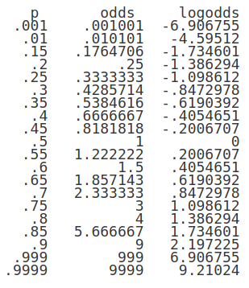

class: bottom, left

```{r setup, include=FALSE, cache = FALSE}
require("knitr")
options(htmltools.dir.version = FALSE)
```

<!---
Para correr en ATOM
- open terminal, abrir R (simplemente, R y enter)
- rmarkdown::render('9_intrologit.Rmd', 'xaringan::moon_reader')

About macros.js: permite escalar las imágenes como [scale 50%](path to image), hay si que grabar ese archivo js en el directorio.
--->

.right[]

<br>
<br>
<br>
<br>
<br>
<br>
<br>

# Estadística multivariada, 1 sem. 2019

## Juan Carlos Castillo & Alejandro Plaza

## **Sesión 9**: Introducción a Regresión Logística

---
class: inverse

# Contenidos

## 1. Introducción

## 2. Regresión lineal vs. Regresión Logística

## 3. Odds y Odds Ratio

## 4. Logit y Regresión logística

---
class: inverse, middle, center

# 1. Introducción

---
class: inverse, center


# ¿Quién sobrevive?

???

Problema:

- En regresión lineal hemos visto la predicción de una variable dependiente continua basada en una o más independientes (continuas o categóricas).
- ¿Qué pasa si nuestra variable dependiente es categórica?¿Podemos usar estimación de mínimos cuadrados?¿Cuáles serían las limitantes técnicas y sustantivas?
- Una primera limitante a considerar: ¿Cómo obtenemos el promedio y la varianza de una variable categórica? ¿Es posible?¿Corresponde hacerlo?

- En esta clase vamos a abordar las posibilidades del modelo de regresión cuando nuestra variable dependiente es categórica (dicotómica)

---
## Variables de respuesta categórica y discretas

- Algunas variables dependientes están limitadas a ciertos valores.

  - Dos posibles valores (binaria; dicotómica)
  - Tres o más posibles valores

      * Sin orden lógica (multinomial)
      * Con orden lógico (ordinal)
      * Con orden lógico y espaciamiento intervalar (conteo)

- Para aquellas respuestas, la regresión estimada por mínimos cuadrados genera una serie de problemas que abordaremos paso a paso.

---
## Variables de respuesta binaria

Las respuestas binarias son aquellas que tienen dos categorías.

  * Y = 1 si algo es "verdadero" u ocurrió.

  * Y = 0 si algo "no es verdadero", o no ocurrió.

Ejemplo de respuestas binarias.

  * Preguntas de Si/No en una encuesta; acuerdo/desacuerdo con alguna visión; Realizar/No Realizar alguna actividad.

  * En política: Votar o abstenerse.

  * En medicina: Tener/no tener cierta condición.

  * En educación: Responder una pregunta de una examen de manera correcta/incorrecta; graduarse o no; aprobar/reprobar un examen, etc.

---
## Fundamentos

La **Regresión Logística** es un método de regresión que permite estimar la probabilidad de una variable cualitativa binaria en función de una o más variables cuantitativas.

--

Una de las principales aplicaciones de la regresión logística es la de clasificación binaria, en el que las observaciones se clasifican en un grupo u otro dependiendo del valor que tome la variable empleada como predictor.

--

**Ejemplos**:

- Clasificar un individuo desconocido como votante o no votante en función de su nivel educacional.

- Predecir la probabilidad de mortalidad (muerto/vivo) en función al consumo de tabaco


---
## Fundamentos

Mediante a **t-test** o **ANOVA** podemos ver si existen diferencias estadísticamente significativas.

Sin embargo, la **regresión logística** permite calcular la probabilidad de que la variable dependiente pertenezca a cada una de las dos categorías en función del valor que adquiera la variable independiente.

---
class: inverse, middle, center

# 2. Regresión lineal vs. regresión logística


---
## ¿Por qué no regresión lineal?

Si una variable cualitativa con dos niveles se codifica como **1** y **0**, matemáticamente es posible ajusta un modelo de regresión lineal por mínimos cuadrados $\beta_{0}+\beta_{1}x$. Este modelo es conocido como _modelo de probabilidad lineal_

--

**El problema** de esta aproximación es que, al tratarse de una recta, para valores extremos del predictor, se pueden obtener valores de **Y** menores que 0 o mayores 1, lo que entra en contradicción con el hecho de que las probabilidades siempre están dentro del rango [0,1].


---
## Ejemplo modelo de probabilidad lineal

.pull-left[
### Ataques al corazón y cigarrillos fumados al año

```{r echo=FALSE, message=FALSE,warning=FALSE}
library(tidyverse)
library(ISLR)
datos <- Default

# Se recodifican los niveles No, Yes a 1 y 0
datos <- datos %>%
         select(ataque=default, cigarros=balance) %>%
         mutate(ataque = recode(ataque,
                                 "No"  = 0,
                                 "Yes" = 1))
#head(datos)
# Ajuste de un modelo lineal por mínimos cuadrados.
modelo_lineal <- lm(ataque ~ cigarros, data = datos)

# Representación gráfica del modelo.
ggplot(data = datos, aes(x = cigarros, y = ataque)) +
  geom_point(aes(color = as.factor(ataque)), shape = 1) +
  geom_smooth(method = "lm", color = "gray20", se = FALSE) +
  theme_bw()  +
  labs(title = "Regresión lineal por mínimos cuadrados",
       y = "Ataque al corazón") +
  theme(legend.position = "none")
```
]

--

.pull-right[

- Si se predice la probabilidad de ataque para alguien que tiene un consumo de cigarros mayor a 10000, el valor obtenido es mayor que 1.

- Si se predice la probabilidad de ataque para alguien que tiene un consumo de cigarros de 400, el valor obtenido es menor que 0.

- _¿Es una recta la mejor forma de modelar este tipo de situaciones?_

]

---
## Modelo logístico

.pull-left[
```{r echo=FALSE, message=FALSE,warning=FALSE}
# Ajuste de un modelo logístico.
modelo_logistico <- glm(ataque ~ cigarros, data = datos, family = "binomial")

# Representación gráfica del modelo.
ggplot(data = datos, aes(x = cigarros, y = ataque)) +
  geom_point(aes(color = as.factor(ataque)), shape = 1) +
  stat_function(fun = function(x){predict(modelo_logistico,
                                          newdata = data.frame(cigarros = x),
                                          type = "response")}) +
  theme_bw() +
  labs(title = "Regresión logística",
       y = "Probabilidad ataque") +
  theme(legend.position = "none")
```
]
.pull-right[

- Para evitar estos problemas, la regresión logística transforma el valor devuelto por la regresión lineal ( $\beta0+\beta_{1}X$ ) empleando una función cuyo resultado está siempre comprendido entre 0 y 1.

- Existen varias funciones que cumplen esta descripción, una de las más utilizadas es la función logística (también conocida como función sigmoide).
]
---
class: inverse, middle, center
## 3. Odds, Odds Ratio y Razón de Probabilidad

---
##Concepto de Odds.

En regresión logística se modela la probabilidad de que la variable respuesta **Y** pertenezca al nivel de referencia 1 en función de los valores que adquieran los predictores mediante el uso del **Logaritmo natural de los Odds Ratios**

--

... pero antes que nada, ¿qué son los odds?

--

formalmente las **odds** es la razón (o cociente) entre la ocurriencia de un evento ($p$) y su no ocurriencia ($q$)


$$Odds=\frac{p}{q}=\frac{p}{1-p}=\frac{\pi}{1-\pi}$$


---
##Odds: paso a paso...

.pull-left[
Para entender el concepto de odds examinaremos la base de datos *titanic*.

Esta base de datos contiene la información de los pasajeros del Titanic:
  - Estatus de sobrevivencia
  - Clase del pasajero
  - Sexo
  - Edad
  - Número de hermanos/pareja a bordo
  - Número de padres/niños a bordo.


]
.pull-right[
```{r echo=FALSE}
knitr::include_graphics("postertitanic.jpg")
```
]

---
## Razón o Ratio

```{r message=FALSE,warning=FALSE, echo=FALSE}
library(tidyverse)
library(haven) #Sirve para cargar las bases .sav (SPSS) y .dta (stata). Es el paquete base que trae R-studio
library(foreign) #Sirve para ingresar datos en .csv (comma separated values) y .dta (stata)
library(texreg) #Sirve para generar tablas en html, plain-text y Latex
library(dplyr)
library(knitr)

load("titanic.Rdata")
```

.pull-left[
Examinamos las frecuencias del estatus de supervivencia
```{r message=FALSE,warning=FALSE}
table(tt$survived)
```
--
Examinamos las probabilidades del estatus de supervivencia
```{r message=FALSE,warning=FALSE}
prop.table(table(tt$survived))
```
]

--
.pull-right[
Existen 427 sobrevivientes, lo que expresa el 41% del total de pasajeros. Esto se puede expresar en términos de razón o ratio. $Odds=427/619=0.41/0.59=0.69$

**Es decir, la probabilidad de sobrevivir es de 0.69 veces a la probabilidad de no sobrevivir.**

O alternativamente

**por cada 100 no sobrevivientes existen 69 sobrevivientes.**


]

---
## Odds de superviviencia para los hombres

.pull-left[
Frecuencias del estatus de supervivencia en relación al sexo
.small[
```{r message=FALSE,warning=FALSE}
table(tt$survived,tt$sex)
```
]
Probabilidades del estatus de supervivencia en relación al sexo (perfil columna)
.small[
```{r message=FALSE,warning=FALSE}
round(prop.table(table(tt$survived,tt$sex),2),2)
```
El 21% de los hombres sobreviven en contraste el 79% no sobrevive.
]
]
--
.pull-right[
Entonces los odds (o razón o ratio) de sobrevivir a la catastrofe del titanic para los hombres son:

$$Odds_{hombres}=\frac{p}{(p-1)}=\frac{0.21}{0.79}=0.27$$

**La probabilidad de sobrevivencia en los hombres es 0.27 veces a la no sobrevivencia**

... o en otros términos

**Hay 0.27 hombres que sobreviven por cada uno que no sobrevive**

**Hay 27 hombres que sobreviven por cada 100 hombres que no sobreviven**
]


---
## Odds de superviviencia para las mujeres

.pull-left[
Examinamos las probabilidades del estatus de supervivencia en relación al sexo (perfil columna)

.small[
```{r message=FALSE,warning=FALSE}
round(prop.table(table(tt$survived,tt$sex),2),2)
```
]

El 75% de las mujeres sobreviven en contraste el 25% no sobrevive.

Entonces los odds (o razón o ratio) de sobrevivir a la catastrofe del titanic para los mujeres son:

$$Odds_{mujeres}=\frac{p}{(p-1)}=\frac{0.75}{0.25}=3$$
]
--
.pull-right[


**La probabilidad de sobrevivencia en las mujeres es 3 veces a la no sobrevivencia**


**Hay 3 mujeres que sobreviven por cada mujer que no sobrevive**

o en otros términos

**Hay 300 mujeres que sobreviven al titanic por cada 100 mujeres que no sobreviven**


]

---
## Odds Ratio

El termino **Odd** refiere a la razón que se establece entre la ocurrencia (o su probabilidad) respecto al suceso de su no ocurrencia.

--

La comparación de los Odds de dos grupos es conocido como **Odds Ratio (OR) o ** $\theta$. Esto equivale a

$$\theta=\frac{odds_{1}}{odds_{2}}=\frac{\pi_{1}/(1-\pi_{1})}{\pi_{2}/(1-\pi_{2})}$$

---
## Odds Ratio

Una Odds Ratio es la razón (o cociente) entre dos *Odds*, carece de unidad de medida y la *Odds* del grupo de interés se debe colocar siempre en el numerador y la de referencia en el denominador.

Para poder interpretar una OR es necesario tener en cuanta cuál es la variable predictora y cuál es el resultado o desenlace (variable dependiente),


**Propiedades:**

- Cuando X e Y son independientes $\theta=1$ ya que $odds_{1}=odds_{2}$

- El rango de posibles valores es: $0<\theta<\infty$

  -Cuando los valores van de 0 a 1, $\theta$ indica que $odds_{1}<odds_{2}$

  -Cuando los valores van de 1 a $\infty$, $\theta$ indica que $odds_{1}>odds_{2}$

- Es una medida de magnitud de asociación simétrica: un $\theta=4$ es una asociació positiva proporcional a la asociación negativa $\theta=1/4=0.25$

---
## Odds ratio de supervivencia para hombres y mujeres.

**¿Cuánto más probable es que las mujeres sobrevivan al titanic en relación a los hombres?**

--

Sabemos que los porcentajes (columna) son:
.small[
```{r message=FALSE,warning=FALSE, echo=FALSE}
round(prop.table(table(tt$survived,tt$sex),2),2)
```
]


$$\theta=\frac{\pi_{m}/(1-\pi_{m})}{\pi_{h}/(1-\pi_{h})}=\frac{0.75/(1-0.75)}{0.21/(1-0.21)}=11.78$$
```{r echo=FALSE, eval=FALSE}
prop.table(table(tt$survived,tt$sex),2)
odd_m<-0.7525773/0.2474227
odd_h<-0.2051672/0.7948328
odd_m/odd_h
odd_h/odd_m

```

**La probabilidad de encontrar una mujer que sobreviva al titanic sobre una que no lo hace es de 11.78 veces respecto al caso de los varones.**

o alternativamente:

**Los odds de sobrevivir al titanic entre las mujeres es [(11.78-1)*100]=1078% más altas que entre los hombres**


---
## Odds ratio de supervivencia para hombres y mujeres.

También podemos hacer la pregunta inversa

**¿Cuánto más probable es que los hombres sobrevivan al titanic en relación a las mujeres?**

Sabemos que los porcentajes (columna) son:
.small[
```{r message=FALSE,warning=FALSE, echo=FALSE}
round(prop.table(table(tt$survived,tt$sex),2),2)
```
]


$$\theta=\frac{\pi_{m}/(1-\pi_{m})}{\pi_{h}/(1-\pi_{h})}=\frac{0.21/(1-0.21)}{0.75/(1-0.75)}=0.08$$
```{r echo=FALSE, eval=FALSE}
prop.table(table(tt$survived,tt$sex),2)
odd_m<-0.7525773/0.2474227
odd_h<-0.2051672/0.7948328
odd_m/odd_h
odd_h/odd_m

```

**La probabilidad de encontrar un hombre que sobreviva al titanic sobre uno que no lo hace es 0.08 veces respecto al caso de las mujeres.**

alternativamente:

**Los odds de sobrevivir al titanic entre los hombres es 92% ([(0.08-1)*100]=-92) más bajas que entre las mujeres.**


---

## ¿Qué tienen que ver los odds ratio con la regresión logística?

.pull-left[.medium[
- Como enunciamos anteriormente, la regresión logística corresponde a una **función del logaritmo natural de los odds ratio**

- En términos generales, los exponentes del logaritmo natural de los coeficientes $\beta$ en la regresión logística pueden interpretarse en términos de Odds Ratio (esto lo veremos con detalle más adelante).

- En la tabla se observa un modelo de regresión logística donde los coeficientes se interpretan en términos de odds ratio.

- **Los odds de sobrevivir al titanic entre las mujeres es [(11.78-1)*100]=1078% más altas que entre los hombres**
]
]
.pull-right[.small[
```{r message=FALSE, warning=FALSE, echo=FALSE, results='asis'}
m2<- glm(survived~sex, data = tt, family = "binomial")
#summary(m2)
library(stargazer)
stargazer(m2,apply.coef = exp,
          apply.se   = exp,
          covariate.labels = "Mujer",
          dep.var.caption = "Variable dependiente",
          dep.var.labels = "Sobrevivío",
          type = "html")

```
]]
---
class: inverse, middle, center

# 4. Logit y Regresión logística


---
## La relación entre Odd y proporción. El logit

La relación entre odds y proporción se puede formalizar de la siguiente manera

$$odd=\frac{p}{1-p}$$
$$(1-p)*odd=p$$
$$odd-p*odd=p$$
$$odd=p+p*odd$$
$$odd=p(1+odd)$$

$$\frac{odd}{1+odd}=p$$
---
## Logit

A partir del Odd podemos definir el logit como el logartimo natural(ln) del Odd

$$Logit=ln(Odd)=ln(\frac{p}{1-p})$$
El logit puede tomar cualquier valor real entre $-\infty$ y $+\infty$. Por otro lado permite una lectura simétrica de la relación entre las proporciones, a diferencia de los odds

**Por ejemplo**
En una muestra 30% son hombres y 70% son  mujeres
$$Odd=0.3/0.7=0.429$$
$$Odd=0.7/0.4=0.233$$
En cambio

$$logit=ln(0.3/0.7)=-0.847$$
$$logit=ln(0.7/0.4)=-0.847$$
---
## Comparación logit y odds según distintas probabilidades

.center[]

---
## Comparación logit y odds según distintas probabilidades

.pull-left[.small[
```{r, echo=FALSE, warning=FALSE,message=FALSE}
p<-seq(0,1,by=0.01)
odd<- p/(1-p)
logit<- log(p/(1-p))
dat<- as.data.frame(cbind(p,odd,logit))

pacman::p_load(plotly, babynames, viridis)

if (!require("hrbrthemes")) devtools::install_github("hrbrmstr/hrbrthemes")

dat %>%
  ggplot( aes(x=p, y=odd)) +
    geom_line(color="#69b3a2", size=1) +
    ggtitle("odd segun valores de p") +
    ylab("odd=p/(1-p)") +
    theme_ipsum()+
    theme(axis.title.y = element_text(size = 16))

```
Rango de $p$ es [0,1]- rango de los odds es [0, $\infty$ ]
]
]
.pull-right[.small[

```{r echo=FALSE, warning=FALSE,message=FALSE}
dat %>%
  ggplot( aes(x=p, y=logit)) +
    geom_line(color="#69b3a2", size=1) +
    ggtitle("logit segun valores de p") +
    ylab("logit=ln(p/(1-p)") +
    theme_ipsum()+
    theme(axis.title.y = element_text(size = 16))
```
Rango de $p$ es [0,1]- rango del logit es [ $-\infty$, $-\infty$ ]
]
]
---
## El Modelo de Regresión Logística Binaria

Para una base de datos con las variables $Y_{i},X_{1i},...,X_{ki}$ con $n$ observaciones $i=1,...,n$, donde:

- $Y$ es una variables binaria con valores 0 y 1

- $X_{1},...,X_{k}$ son k variables explicativas

- Para cada unidad $i$, la probabilidad de Y=1 se considera como $P(Y_{i}=1)=\pi_{i}$

$$ln(odd_{i})=ln(\frac{\pi_{i}}{1-\pi_{i}})=\beta_{0}+\beta_{1}X{1}+...+\beta_{k}X{k}$$
---
## Modelando las probabilidades
A pesar de que el modelo está escrito para logit, es posible hacer la transformación a probabilidades

.small[
$$ln(\frac{\pi_{i}}{1-\pi_{i}})=\beta_{0}+\beta_{1}X{1}+...+\beta_{k}X{k}$$
]
--
.small[
$$\frac{\pi_{i}}{1-\pi_{i}}=exp(\beta_{0}+\beta_{1}X{1}+...+\beta_{k}X{k})$$
]
--
.small[
$$\pi_{i}=(1-\pi_{i})exp(\beta_{0}+\beta_{1}X{1}+...+\beta_{k}X{k})$$
]
--
.small[
$$\pi_{i}=exp(\beta_{0}+\beta_{1}X{1}+...+\beta_{k}X{k})-\pi_{i}exp(\beta_{0}+\beta_{1}X{1}+...+\beta_{k}X{k})$$
]
--
.small[
$$\pi_{i}+\pi_{i}exp(\beta_{0}+\beta_{1}X{1}+...+\beta_{k}X{k})=exp(\beta_{0}+\beta_{1}X{1}+...+\beta_{k}X{k})$$
]
--
.small[
$$\pi_{i}(1+exp(\beta_{0}+\beta_{1}X{1}+...+\beta_{k}X{k}))=exp(\beta_{0}+\beta_{1}X{1}+...+\beta_{k}X{k})$$
]
--
.small[
$$\pi_{i}=\frac{exp(\beta_{0}+\beta_{1}X{1}+...+\beta_{k}X{k})}{(1+exp(\beta_{0}+\beta_{1}X{1}+...+\beta_{k}X{k}))}$$
]
---
class:inverse

# Resumen

--

- DIFICIL

--

- ¿Para qué hacer regresión con dependientes categóricas? (...siendo que hay otras alternativas como diferencias de medias o tablas cruzadas)

--
  - CONTROL

--

- ¿Es gratis?

  - ### NO

--

- Cuadrando el círculo: ¿Cómo utilizar una función lineal para variables categóricas?

--

  - Restricción del rango entre 1 y 0 de la dependiente para la predicción basada en el modelo.

---
class:inverse

# Resumen

- Requiere:

  - redondear el cuadrado: probabilidad, odds, odds ratio, logit, exponenciar ....

--

- PERO: bases interpretación

    - logits se interpretan directamente como log de los odds (valores negativos y positivos)

    - Odds-ratio: se interpreta como razones o odds(desde 0 en adelante). Donde 1 indica ausencia de efecto, menor que 1 es negativo y mayor que 1 es positivo

---
class: bottom, left

.right[]

<br>
<br>
<br>
<br>
<br>
<br>
<br>

# Estadística multivariada, 1 sem. 2019

## Juan Carlos Castillo & Alejandro Plaza

## **Sesión 8**: Introducción a Regresión Logística
