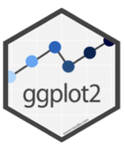

# Visualización de datos con ggplot2
```

```



Es importante que en un informe acádemico se incorpore visualización de datos, pues muchas veces resulta agobiante al lector solo reportar los análisis en textos y tablas. A continuación, introduciremos algunos tópicos básicos y avanzados en visualización de datos con ggplot2. Utilizaremos como ejemplo los datos del Estudio Longitudinal Social de Chile (ELSOC, 2016).

- **Instalar y cargar paquetes**
```{r}
#Instalamos los paquetes que necesitaremos
#install.packages("ggplot2") #Gráficos
library(ggplot2)
library(haven)
```

- **Tratamiento de los datos**
```{r}
#Leemos el conjunto de datos.
elsoc_w01<-read_dta("https://juancarloscastillo.github.io/metsoc-facsouchile/documents/data/COESW1_Stata14_V3.dta")
#Establecemos los casos perdidos a variables de interés.
elsoc_w01[elsoc_w01==-999 | elsoc_w01==-888] <- NA

```

Una vez cargado el conjunto de datos y asignado los casos perdidos, podemos comenzar realizar diferentes tipos de visualizaciones de datos.

- **Gráficos de barra**:
```{r}
#Grafico de barras para la variabla horas habituales por tramos
ggplot(elsoc_w01, aes(x = as.factor(d05_01))) +
  geom_bar(width = 0.4, fill=rgb(0.1,0.3,0.5,0.7) ,aes(y = (..count..)/sum(..count..))) +
  scale_x_discrete("Provenir de familia adinerada",
                   labels = c("Nada importante",
                              "Poco importante",
                              "Algo importante",
                              "Bastante importante",
                              "Muy importante"), na.translate = FALSE) +
  scale_y_continuous("Frecuencia porcentual",labels=scales::percent ) +
  labs(title = "Gráfico de barras",
       subtitle = "¿Qué tan importante es provenir de una familia adinerada?")
```

- **Gráficos de violín**:
Podemos observar la dispersión de datos mediante los gráficos de violín. En el ejemplo, se utilizan las variables "Identificación clase social subjetiva" e "Importancia atribuida a tener ambición".
```{r}
ggplot(data = elsoc_w01, aes(x = c33, y = d05_03)) +
  geom_jitter(size = 1, color = 'blue', alpha = 0.4) +
  geom_violin(aes(fill = d05_01), color = 'black', alpha = 0.8) +
  xlab('Identificación clase social subjetiva') +
  ylab('Importacia atribuida a la ambición') +
  ggtitle('Dispersión bivariada de datos: clase social subjetiva y ambición') +
  theme_minimal()
```


- **Histograma de densidad con curva normal**:
Recomendamos reportar características sociodemográficas con histogramas. En este caso no emplearemos un histograma tradicional con barras, sino que es un histograma de densidad.
```{r}
ggplot(elsoc_w01, aes(x = as.numeric(m0_edad))) +
  geom_density(color="black") +
  stat_function(fun = dnorm,
                args = with(elsoc_w01, c(mean = mean(m0_edad, na.rm=T), sd = sd(m0_edad, na.rm=T))), color = "red")+
  scale_y_continuous("Densidad") +
  labs(title = "Histograma",
       subtitle = "Edad")
```


-**Tabla para reportar un modelo de regresión**

El reporte de resultados de los parámetros estimados (e.g., coeficientes B, F de Levene, R2, suma de cuadrados) podemos realizarlo en tablas con este formato y estilo

```{r echo=F, warning=FALSE, message=FALSE,results='hide'}
elsoc_w01[elsoc_w01==-999 | elsoc_w01==-888] <- NA
elsoc_w01$sexo<- as.factor(car::recode(elsoc_w01$m0_sexo, "1='Hombre'; 2='Mujer'"))
elsoc_w01$ed<- as.factor(elsoc_w01$m01)
elsoc_w01$edu<- car::recode(elsoc_w01$ed, "10 ='Universitaria';1:3='Básica'; 4:5='Media'; 6:7='Tecnica Superior'; 8:9 ='Universitaria'")
elsoc_w01$edu<- as.factor(elsoc_w01$edu)
modelo1<- lm(d01_01 ~ m0_edad+ m29 +sexo, data=elsoc_w01)
modelo2<- lm(d01_01 ~ m0_edad+ m29 +sexo+edu, data=elsoc_w01)
library(texreg)
```
```{r echo=F, warning=FALSE, message=FALSE,results='asis'}
htmlreg(list(modelo1, modelo2),
        custom.model.names = c("Modelo 1", "Modelo 2"),
        custom.coef.names = c("Intercepto", "Edad", "Ingreso", "Mujer", "Media","Técnica","Universitaria"),   #Cambiar nombre de las variables
        include.f=TRUE,
        include.rmse=FALSE,
        custom.note = "%stars., errores estándar en paréntesis",
        caption=" ",
        #single.row = T, #para que la DS este en una linea
        booktabs = TRUE, dcolumn = TRUE, doctype = FALSE)
```

-**Gráfico de mosaico**

Para quienes deban aplicar un modelo de regresión logística binaria (RLB), recomendamos utilizar los gráficos de mosaico para visualizar descriptivamente las variables categóricas.
```{r echo=FALSE, fig.height=6}
#install.packages("pacman")
library("pacman")
load("titanic.Rdata")

pacman::p_load(sjmisc, descr,tidyverse, scales, xtable, ggmosaic, stargazer)
ggplot(data = tt) +
  geom_mosaic(aes(x = product(sex), fill=survived)) +
  theme(legend.position="none", text = element_text(size = 25),axis.title=element_blank())
```

Finalmente, podemos realizar gráficos dinámicos. Usando los datos del paquete gapminder, construiremos un gráfico animado que incluya la expectativa de vida de los diferentes países y PIB per cápita en el transcurso de los años (gráfico con tres variables interactuando).

```{r}
#Instalar y cargar paquetes
#install.packages("gifski") #crea gif
#install.packages("gapminder") #paquete que contiene bases de datos de estadisticas mundiales
#install.packages("gganimate")
#install.packages("dygraphs")
#install.packages("png")

library(gifski)
library(gapminder)
library(gganimate)
library(dygraphs)
library(png)

# Creditos en GitHub a Thomasp85
# https://gist.github.com/thomasp85/05169ad44ddcc8ed56da6ff7bf7fbe36

dato<-gapminder
ggplot(gapminder, aes(gdpPercap, lifeExp, size = pop, colour = country)) +
  geom_point(alpha = 0.7, show.legend = FALSE) +
  scale_colour_manual(values = country_colors) +
  scale_size(range = c(2, 12)) +
  scale_x_log10() +
  facet_wrap(~continent) +
  # Acá con gganimate especificamos el gif
  labs(title = 'Year: {frame_time}', x = 'GDP per capita', y = 'life expectancy') +
  transition_time(year) +
  ease_aes('linear')
```

Tal como se puede observar, tenemos cuatro variables interactuando en el gráfico: a) países (categórica); b) expectativa de vida (intervalar); c) PIB per cápita (intervalar); y d) tiempo en años (intervalar).
