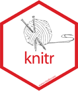

En la investigación académica en general el proceso de escritura se encuentra separado del análisis, en programas y documentos distintos. El traspaso de información entre el programa de análisis y el programa de edición de texto se realiza con un clásico: cortar y pegar.

_¿Cuáles son las desventajas de cortar y pegar?_

- La principal es el límite a la reproducibilidad. ¿Cómo identificar los análisis que finalmente son reportados?

- Eficiencia: cada vez que se realicen cambios en los análisis, nuevamente implica cortar-pegar, y es difícil llevar un registro apropiado de las versiones de los documentos.

Los **documentos dinámicos** permiten lidiar con las limitaciones anteriores, ya que los análisis y resultados están en un mismo documento. Esto es posible ya que se combinan dos lenguajes en texto plano: escritura y código de análisis. La clave es que el programa de edición y de análisis pueda identificar qué secciones del texto corresponden a escritura y cuáles corresponden a análisis.

# Sobre texto plano

_¿Por qué escribir en texto plano en lugar de un programa que me muestre inmediatamente el texto y su formato (tipo Word)?_
Hay múltiples razones, solo resalto dos:

1 - **Propiedad**: los contenidos guardados en formatos de procesadores comerciales (como Word) dependen del pago de una licencia para poder leerse. Si el software es imposible leerlos, por lo tanto la propiedad de los contenidos guardados en ese formato no son del autor/a, sino de la empresa de software. El texto plano no depende de un software comercial para poder leerse ni modificarse.

2 - **Flexibilidad en incorporación de texto y análisis**: el escribir en texto plano permite incluir en un mismo documento elementos de escritura y de análisis de datos realizado en texto plano, por lo tanto no se requiere cortar ni pegar en otro documento.

Actualmente existen una serie de herramientas que facilitan la elaboración de documentos dinámicos, en particular basados en la librería `knitr` (tejer). Esta librería permite generar documentos escritos en lenguaje Markdown y análisis realizado en R.


# Markdown

Combinar texto y código de análisis requiere que ambos puedan ser generados en una misma plataforma. Y para poder hacer esto, una solución es que lo que se escriba en el documento sea libre de plataforma. El texto plano es una forma de escribir que no requiere ningún programa especial para poder acceder o generar un documento. El ejemplo más cercano para los usuarios de Windows son los archivos .txt, que se pueden abrir con cualquier editor simple.

Ahora bien, también para escribir necesitamos elementos de edición, como por ejemplo encabezados, listas, imágenes, negritas, cursivas. Y es aquí donde Markdown permite integrar elementos de edición en texto plano. ¿Cómo se hace? incorporando código o "marcas" de edición, pero de la manera más simple posible (de ahí el nombre markdown, marcas bajas o pocas marcas). Estas marcas indican las partes del texto que luego serán interpretadas de una manera especial al momento de convertir el documento a otro formato que sea más amigable a la publicación (como html o pdf). Por lo tanto, la manera de trabajar es en base a un editor de texto plano, y que al final se convierte a un documento publicable.

## Marcas de edición

### Títulos

Los títulos se generan mediante el caracter # , de la siguiente manera:

```
# Titulo 1
## Título 2
### Título 3
```

Lo que al convertir genera lo siguiente:

# Titulo 1
## Título 2
### Título 3

---
### Negritas / cursivas

```
esto es **negrita**
esto es *cursiva*
```
esto es **negrita**
esto es _cursiva_

---

### Listas

        ```
        - item 1
        - item 2
          - item sub 2
            - item sub 2 sub 2

        1. item
        2. item
            - item
            - item
        ```

- item 1
- item 2
  - item sub 2
    - item sub 2 sub 2

1. item
2. item
    - item
    - item

---
### Web links

[Facso](http://www.facso.uchile.cl/)
[http://www.facso.uchile.cl/](http://www.facso.uchile.cl/)

```
[Facso](http://www.facso.uchile.cl/)
[http://www.facso.uchile.cl/](http://www.facso.uchile.cl/)
```

---
### Imágenes

En general:
```

```

Ejemplo:
```

```


Esta imagen se encuentra en el subdirectorio images

Si se desea agregar otros elementos de edición como centrado o tamaño, hay que recurrir a marcas de html:

```
<p align="center">
  
</p>
```
<p align="center">
  
</p>

Como se puede ver, markdown está hecho para edición simple, y cualquier aspecto que requiera una mayor edición implica recurrir a otros lenguajes, en este caso html.


---
### Tablas

Markdown no es un lenguaje óptimo para generar tablas. Justamente se trata de que las tablas sean generadas automáticamente por los programas de análisis de datos. Sin embargo en ocasiones es necesario realizar tablas con contenidos de texto, por ejemplo

```
Esta        |es        | la tabla
 -          |-         |-
y           | este     | el
contenido   | de las   | celdas
```


Esta        |es        | la tabla
 -          |-         |-
y           | este     | el
contenido   | de las   | celdas


# Knitr

Knitr es una librería de R que convierte (compila) documentos escritos en Rmarkdown y que combinan texto y análisis hacia otros formatos. Esto es posible ya que reconoce marcas de edición y código de análisis y permite su transformación a formatos como pdf, word y html. Una representación del flujo según Healey es la siguiente:


El documento central de trabajo es uno en formato .Rmd (Rmarkdown), que combina texto en Markdown y código R, lo que se detalla más abajo. La librería `Knitr` hace la transformación de este documento a formatos como html y/o pdf, para lo cual utiliza el convertidor pandoc.

No es necesario conocer al detalle todos los elementos de este flujo para hacer funcionar un documento dinámico, sino básicamente dos: 1) Markdown, y 2) Trozos de código. Vamos por parte.

## Trozos (chunks) de código

La caracteristica principal de `Knitr` es que identifica las secciones de código en la hoja y los ejecuta mediante R. Estos trozos de código se encuentran delimitados de la siguiente manera:

    ```{r}
    4+5
    ```


Es decir, todo lo que comience por ` ```r` y termine con ` ``` ` será identificado como código de análisis (el atajo para generar un chunk en RStudio es `ctrl+alt+i`)

### Tipos de chunks

En general hay cinco opciones básicas de edición relacionadas con chunks y su visualización en el documento final. Esto se maneja mediante opciones que aparecen al inicio en el chunk, luego de la letra `r`

1. código y resultado (opción por defecto)
2. solo código:

````
```{r, echo=FALSE}
1 + 1
```
````

Resulta:

```{r echo=TRUE}
1 + 1
```


3. solo resultado `{r echo=FALSE}`
4. ni código ni resultado `{r echo=FALSE eval=FALSE}`
5. resultado "tal cual como es": `{r results='asis'}` se utiliza principalmente para comandos de generación de tablas, que arrojan un código que luego puede ser interpretado por otro lenguaje (por ejemplo, html)

# Trabajando con documentos dinámicos en RStudio

RStudio es principalmente un editor para análisis de datos con R, pero últimamente ha ido incorporando herramientas para reportes dinámicos. Para ello utiliza un tipo de archivos con extensión `Rmd` que significa Rmarkdown. Y en este contexto Rmarkdown es la forma en que Rstudio identifica los archivos que combinan texto y código.

Para generar un archivo Rmarkdown, simplemente new file > Rmarkdown


Y luego para convertir este documento, presionar el boton `Knitr`.

El generador de documentos por defecto trae un texto de ejemplo donde hay analisis y tablas, y además dos cosas:

- **Preámbulo o YAML (Yet Another Markdown Language)**: esta sección del inicio que se encuentra enmarcada entre `---` incluye algunos datos básicos del documento que luego se consideran al momento de convertirlo al documento editado final. Por ejemplo, si se prefiere que la conversión sea a html,  se incluye la opción `output: html_document`

      ---
      title: "nuevo"
      author: "jc"
      date: "5/30/2019"
      output: html_document
      ---

- **Chunk de opciones generales**: va al inicio del documento, luego del YAML. En general, la que aparece por defecto `echo=TRUE` se refiere a que se muestren los resultados de los chunks de código.
